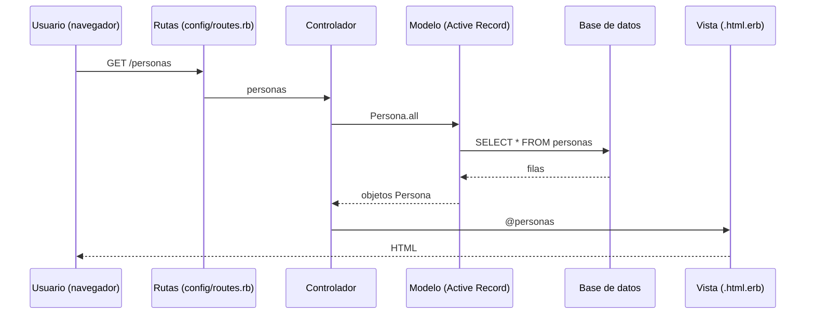

# Patrón MVC en Rails

MVC (Modelo-Vista-Controlador) es la **arquitectura que estructura una aplicación Rails**: separa los datos (modelo), lo que ve el usuario (vista) y la lógica que los conecta (controlador).

## MVC
- **Arquitectura** que estructura la aplicación, permitiendo organizar la lógica, las vistas, etc.
- **Modelo:** donde haremos todo nuestro manejo de datos con la base de datos.
- **Controlador:** maneja la lógica de negocio, los requests de usuarios y el flujo de llevar la data desde el modelo a la vista (**intermediario**).
- **Vista:** responsable de lo que el usuario visualiza.

## En Rails (Pt. 1)
- **Controllers** → clase que controla las interacciones con el usuario, la vista y el modelo.
- **Models** → permiten interactuar con la **BASE DE DATOS**.
- **Routes** → rutas para ser usadas por el usuario; se conectan con el controlador.

> [!tip] Complemento — dónde vive cada parte en un proyecto Rails
> | Capa | Carpeta | Ejemplo |
> |---|---|---|
> | Modelo | `app/models/` | `persona.rb` → [[04 - Modelos y Active Record\|Modelos y Active Record]] |
> | Vista | `app/views/<recurso>/` | `personas/index.html.erb` → [[11 - Vistas ERB\|Vistas ERB]] |
> | Controlador | `app/controllers/` | `personas_controller.rb` → [[09 - Controladores en Rails\|Controladores en Rails]] |
> | Rutas | `config/routes.rb` | `resources :personas` → [[10 - Rutas en Rails\|Rutas en Rails]] |
>
> **Por qué separar:** cada parte tiene una sola responsabilidad (**alta cohesión**) y se puede cambiar una sin tocar las demás (**bajo acoplamiento**). Por ejemplo, se puede cambiar la vista HTML por una respuesta JSON sin tocar el modelo.

## Preguntas de repaso

1. ¿Qué responsabilidad tiene cada componente de MVC?
> [!question]- Respuesta
> Modelo: los datos y su interacción con la base de datos. Vista: lo que el usuario ve. Controlador: recibe los requests, aplica la lógica y lleva los datos del modelo a la vista (intermediario).

2. Describe qué ocurre cuando un usuario visita `/personas`.
> [!question]- Respuesta
> La ruta dirige el request a `PersonasController#index`, que pide `Persona.all` al modelo (que consulta la base de datos). El controlador deja el resultado en `@personas` y Rails renderiza `index.html.erb`, que genera el HTML de respuesta.

3. ¿Por qué el controlador es "intermediario"?
> [!question]- Respuesta
> Porque el modelo y la vista no se hablan directamente: el controlador obtiene los datos del modelo y se los entrega a la vista.
