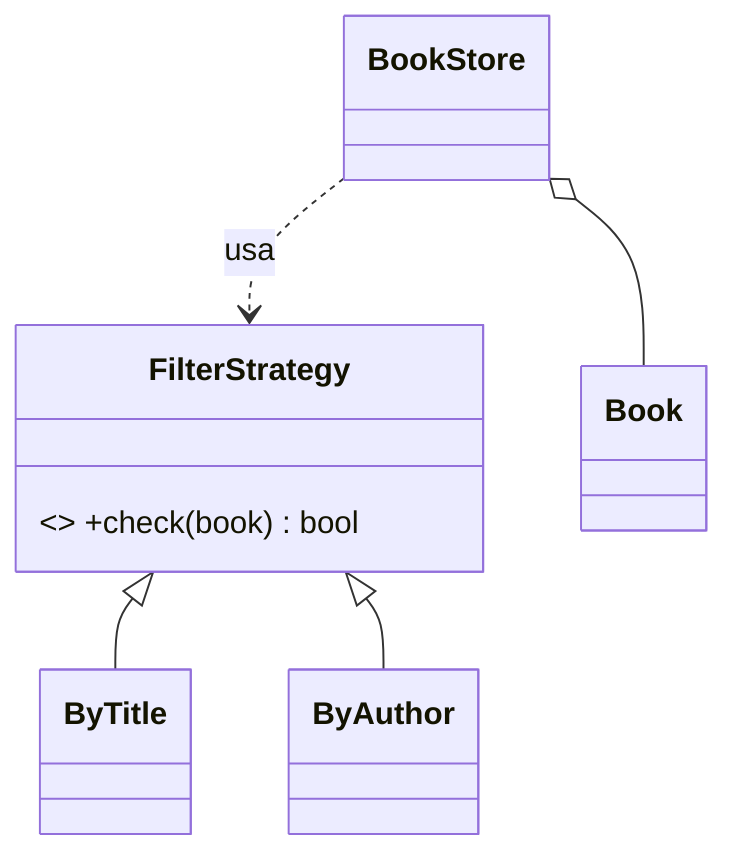

# Ejemplo de diseño: filtros de libros

Ejemplo de clase sobre **código duplicado dentro de una clase**: dos métodos de filtro casi iguales se reemplazan por estrategias intercambiables. Es un adelanto del patrón Strategy.

## Ejemplo 2 (código duplicado)


> [!note]- Transcripción de la imagen
> ```ruby
> # BookStore.rb
> require_relative 'book'
> class BookStore
>   def initialize
>     @books = []
>   end
>   def add(book)
>     @books.push(book)
>   end
>   def filterByAuthor(name)
>     @books.each do |book|
>       if book.author == name
>         book.print
>       end
>     end
>   end
>   def filterByTitle(title)
>     @books.each do |book|
>       if book.title == title
>         book.print
>       end
>     end
>   end
> end
>
> # Book.rb
> class Book
>   attr_reader :title
>   attr_reader :author
>   attr_reader :year
>   def initialize(title, author, year)
>     @title = title
>     @author = author
>     @year = year
>   end
>   def print
>     puts "#@title by #@author version #@year"
>   end
> end
>
> # main.rb
> require_relative 'book.rb'
> require_relative 'book_store.rb'
> store = BookStore.new
> store.add(Book.new("Testing","juampi",2022))
> store.add(Book.new("Ing. Software","jaime",2022))
> store.add(Book.new("Testing","rodrigo",2021))
> puts 'searching for jaime'
> store.filterByAuthor("jaime")
> puts 'searching for testing'
> store.filterByTitle("Testing")
> ```

- `BookStore` **repite código** en los métodos `filterByTitle` y `filterByAuthor`.
- Si se quiere añadir otro filtro, habría **más código duplicado**.

## Código mejorado


> [!note]- Transcripción de la imagen
> ```ruby
> require_relative 'book'
> class BookStore
>   def initialize
>     @books = []
>   end
>   def add(book)
>     @books.push(book)
>   end
>   def filter(strategy)
>     @books.each do |book|
>       if strategy.check(book)
>         book.print
>       end
>     end
>   end
> end
>
> class FilterStrategy
>   def check(book)
>     raise NotImplementedError
>   end
> end
>
> require_relative 'filter_strategy'
> class ByTitle < FilterStrategy
>   def initialize(title)
>     @title = title
>   end
>   def check(book)
>     book.title == @title
>   end
> end
>
> require_relative 'filter_strategy'
> class ByAuthor < FilterStrategy
>   def initialize(author)
>     @author = author
>   end
>   def check(book)
>     book.author == @author
>   end
> end
> ```

- Ya no tendremos que modificar `BookStore` ni `Book` en caso de añadir más filtros.
- Solo se crea otra estrategia (clase nueva que hereda de `FilterStrategy`).
- Está **"Abierto para Extensiones, Cerrado para Modificaciones"** → [[06 - Principio abierto-cerrado|Principio abierto-cerrado]].



> [!tip] Complemento
> Uso: `store.filter(ByAuthor.new("jaime"))`. Este diseño **es el patrón Strategy**: `BookStore` es el contexto y cada filtro es una estrategia intercambiable.

## Preguntas de repaso

1. ¿Qué problema tenía el `BookStore` original?
> [!question]- Respuesta
> Código duplicado: `filterByAuthor` y `filterByTitle` eran casi idénticos, y cada filtro nuevo agregaría otro método repetido.

2. ¿Cómo se agrega un filtro por año en el diseño mejorado?
> [!question]- Respuesta
> Creando `class ByYear < FilterStrategy` con `check(book)` que compare `book.year`. No se toca `BookStore` ni `Book`.

3. ¿Qué patrón de diseño es el código mejorado?
> [!question]- Respuesta
> Strategy: `BookStore` (el contexto) recibe un objeto estrategia y llama a su método común `check`.
