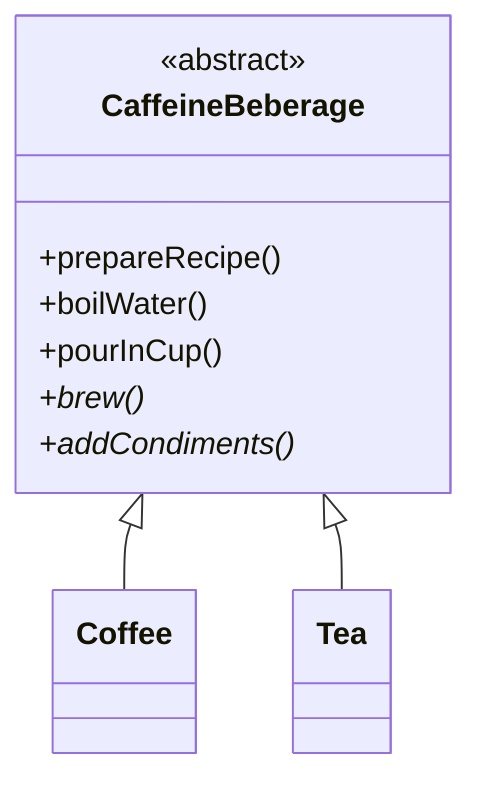

# Ejemplo de diseño: bebidas con cafeína

Ejemplo de clase sobre **código duplicado entre clases**: `Tea` y `Coffee` repiten la receta. Se sube lo común a una clase abstracta y cada hija sobrescribe solo lo que cambia. Es un adelanto del patrón Template Method.

## Ejemplo 3 (código duplicado entre clases)


> [!note]- Transcripción de la imagen
> ```ruby
> class Tea
>   def prepareRecipe
>     boilWater
>     steepTeaBag
>     addLemon
>     pourInCup
>   end
>   def boilWater
>     puts 'boiling water'
>   end
>   def steepTeaBag
>     puts 'steeping tea'
>   end
>   def addLemon
>     puts 'adding lemon'
>   end
>   def pourInCup
>     puts 'Pouring in cup'
>   end
> end
>
> class Coffee
>   def prepareRecipe
>     boilWater
>     brewCoffeeGrinds
>     pourInCup
>     addSugarAndMilk
>   end
>   def boilWater
>     puts 'boiling water'
>   end
>   def brewCoffeeGrinds
>     puts 'dripping coffee through filter'
>   end
>   def pourInCup
>     puts 'Pouring in cup'
>   def addSugarAndMilk          # (en la imagen falta el end de pourInCup)
>     puts 'adding sugar and milk'
>   end
> end
> ```

- Otra clase tendría mucho **más código duplicado** (`boilWater` y `pourInCup` ya se repiten).

## Solución (abstracta + override en clases separadas)


> [!note]- Transcripción de la imagen
> ```ruby
> class CaffeineBeberage
>   def prepareRecipe
>     boilWater
>     brew
>     pourInCup
>     addCondiments
>   end
>   def boilWater
>     puts 'boiling water'
>   end
>   def pourInCup
>     puts 'Pouring in cup'
>   end
>   def brew
>     raise NotImplementedError
>   end
>   def addCondiments
>     raise NotImplementedError
>   end
> end
>
> require_relative 'caffeine_beberage'
> class Coffee < CaffeineBeberage
>   def brew
>     puts 'dripping coffee through filter'
>   end
>   def addCondiments
>     puts 'adding sugar and milk'
>   end
> end
>
> require_relative 'caffeine_beberage'
> class Tea < CaffeineBeberage
>   def brew
>     puts 'steeping tea'
>   end
>   def addCondiments
>     puts 'adding lemon'
>   end
> end
> ```



> [!tip] Complemento (slides "Diseño Orientado al Objeto")
> - **Ventajas:** se elimina el código duplicado y es fácil agregar nuevos tipos de bebida. Las clases que hereden de `CaffeineBeberage` reutilizan sus métodos y evitan duplicar en futuras modificaciones.
> - **Esto es el patrón Template Method:** `prepareRecipe` es el método plantilla (el esqueleto del algoritmo) y `brew` y `addCondiments` son los pasos que cada hija define.
> - Ojo: el `Tea` original agregaba el limón **antes** de servir. Al unificar la receta, el orden pasa a ser el mismo para todas (servir y después condimentar). Unificar a veces obliga a acordar un algoritmo común.
> - "Beberage" es una errata de *Beverage* que viene de la slide.

## Preguntas de repaso

1. ¿Qué código se duplicaba entre `Tea` y `Coffee`?
> [!question]- Respuesta
> `boilWater` y `pourInCup` (idénticos) y la estructura de `prepareRecipe`.

2. ¿Qué hace la clase `CaffeineBeberage`?
> [!question]- Respuesta
> Define el algoritmo común (`prepareRecipe`) y los pasos compartidos, y deja como abstractos (`NotImplementedError`) los pasos que varían: `brew` y `addCondiments`.

3. ¿Cómo agregarías un chocolate caliente?
> [!question]- Respuesta
> `class HotChocolate < CaffeineBeberage` implementando `brew` (por ejemplo, disolver cacao) y `addCondiments` (marshmallows). No se modifica la clase padre.
