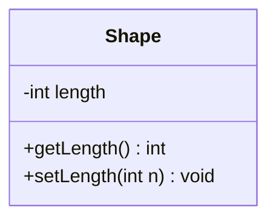

# Diagrama de clases UML

El diagrama de clases muestra la **estructura estática** de un sistema: las clases (con sus atributos y operaciones) y las relaciones entre ellas. Es el diagrama UML más usado y el que más se pide en la prueba.

## Diagramas de clases

> [!note]- Transcripción de las imágenes
> - Una clase es un rectángulo con **3 compartimentos**: **nombre**, **atributos** y **operaciones** (métodos).
> - *Sin firma:* `Shape` con `-length`, `+getLength()` y `+setLength()`. *Con firma:* `-length : int`, `+getLength() : int` y `+setLength(n : int) : void`.
> - `MyClassName` tiene 3 atributos y 3 operaciones: `+attribute : int`, `-attribute2 : float`, `#attribute3 : Circle`, `+op1(in p1 : boolean, in p2) : String`, `-op2(inout p3 : int) : float` y `#op3(out p6) : Class6*`. op2 retorna un float, el parámetro p3 de op2 es de tipo int y op3 retorna un puntero (`*`) a Class6.

La visibilidad (`+`, `-`, `#`) se ve en [[02 - Visibilidad en UML|Visibilidad en UML]].

> [!tip] Complemento (slides "UML" y libro del curso, cap. 8)
> - **Nivel de detalle:** se puede dibujar cada clase con más o menos detalle, pero **en la interrogación hay que escribirlas con el mayor detalle posible**: tipos, parámetros, retornos y visibilidad.
> - **Cardinalidad (multiplicidad):** en los extremos de una asociación se indica cuántos objetos participan: `1`, `0..1`, `0..*` (o `*`), `1..*`. Por ejemplo, un Cliente tiene `0..*` Pedidos y cada Pedido es de `1` Cliente.
> - **Modelo de dominio** (análisis): un diagrama de clases con solo las entidades y sus asociaciones, sin métodos. Se parece a un modelo entidad-relación. Las clases candidatas se buscan en las historias de usuario.
> - **Tarjetas CRC** (*Class–Responsibility–Collaborators*): una tarjeta por clase con su nombre, sus responsabilidades (qué sabe y qué hace) y sus colaboradores (otras clases que necesita). Ayudan a descubrir las clases antes de dibujar.
> - Ver también [[04 - Relaciones entre clases en UML|Relaciones entre clases]] y el ejemplo completo de tienda online en esa nota.

## Preguntas de repaso

1. ¿Qué tres compartimentos tiene una clase en UML?
> [!question]- Respuesta
> Nombre, atributos y operaciones (métodos).

2. ¿Cómo se escribe un atributo privado `length` de tipo entero y un método público `setLength` que recibe un entero y no retorna nada?
> [!question]- Respuesta
> `-length : int` y `+setLength(n : int) : void`.

3. ¿Qué significa la multiplicidad `0..*` en un extremo de una asociación?
> [!question]- Respuesta
> Que puede haber cero o más objetos de esa clase relacionados con uno de la otra.

4. ¿Con qué nivel de detalle hay que dibujar las clases en la prueba?
> [!question]- Respuesta
> Con el mayor detalle posible: atributos y métodos con su visibilidad, tipos, parámetros y retornos, además de las relaciones con su multiplicidad.
