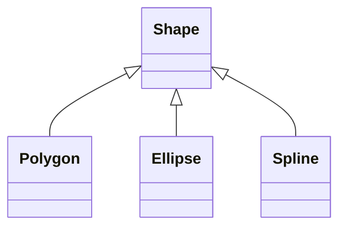
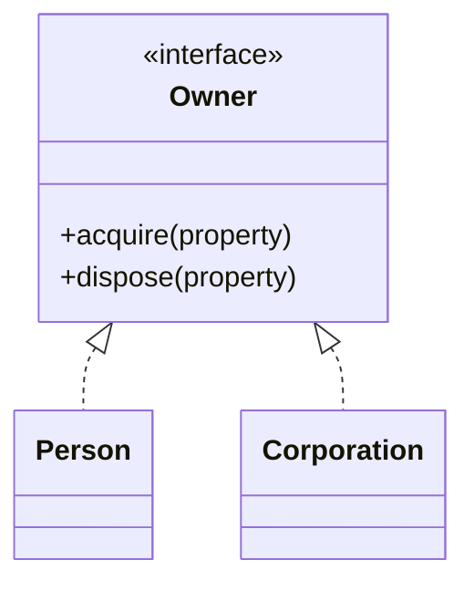

# Herencia y realización en UML

La **herencia** (generalización) se dibuja con una línea continua y una punta de triángulo vacío hacia el padre. La **realización** (implementar una interfaz) se dibuja igual, pero con línea punteada.

## Herencia

Se pueden utilizar **cualquiera de los 2** estilos.

> [!note]- Transcripción de la imagen
> `Polygon`, `Ellipse` y `Spline` heredan de `Shape`. **Estilo 1 (separate target):** una flecha de triángulo por cada hija. **Estilo 2 (shared target):** las flechas se juntan en un solo triángulo.

## Realización (interfaz) → en Ruby es un módulo

> [!note]- Transcripción de la imagen
> La interfaz `<<Interface>> Owner` (`+acquire(property)`, `+dispose(property)`) es realizada por `Person` (`-real`, `-tangible`, `-intengible`) y por `Corporation` (`-current`, `-fixed`, `-longTerm`, `-intangible`), con flechas punteadas de triángulo vacío.

> [!tip] Complemento (slides "UML" y libro del curso, cap. 8.10–8.11)
> - Una **interfaz** es un **contrato**: define métodos sin implementarlos. La clase que la realiza está obligada a implementarlos. Una clase puede implementar varias interfaces y una interfaz puede tener varias implementaciones.
> - **Ruby no tiene interfaces**: se simulan con un **módulo** o con una **clase abstracta** (métodos que lanzan `NotImplementedError`; ver [[10 - Clases abstractas en Ruby|Clases abstractas en Ruby]]).
> - En UML la interfaz se dibuja como una clase con el estereotipo `«interface»` o como un círculo.
> - Las clases abstractas se marcan con `<<abstract>>` o con el nombre en cursiva.

## Preguntas de repaso

1. ¿Qué diferencia visual hay entre herencia y realización?
> [!question]- Respuesta
> Ambas usan punta de triángulo vacío hacia el padre o la interfaz. La herencia usa línea continua y la realización, línea punteada.

2. ¿Cuál es el equivalente de una interfaz en Ruby?
> [!question]- Respuesta
> Un módulo (o una clase abstracta cuyos métodos lanzan `NotImplementedError`), porque Ruby no tiene interfaces propiamente tales.

3. ¿Es correcto usar un solo triángulo compartido por varias subclases?
> [!question]- Respuesta
> Sí, es el estilo 2 (shared target). Se puede usar cualquiera de los dos.
