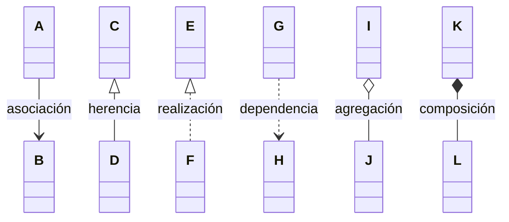

# Relaciones entre clases en UML

UML tiene **6 tipos de relación** entre clases, y cada uno se dibuja con una línea o punta distinta: asociación, herencia, realización, dependencia, agregación y composición.

## Relaciones entre clases

- **Association:** un objeto de la clase tiene una referencia a un objeto de otra clase **por mucho tiempo** (ej.: atributos).
- **Herencia:** una clase hereda de otra.
- **Realization:** una clase implementa una interfaz o módulo.
- **Dependency:** un objeto de la clase tiene una referencia a otro objeto de otra clase **de forma temporal** (ej.: variables temporales o argumentos).
- **Aggregation:** un objeto de la clase A (**rombo vacío**) está compuesto por objetos de la clase B. Los objetos de B **no son creados dentro de A**.
- **Composition:** un objeto de la clase A (**rombo lleno**) está compuesto por objetos de la clase B. Los objetos de B son creados dentro de B, creando dependencia. Un objeto derivado no podría existir sin su principal.

> [!warning] Posible error (registrado en `_meta/DUDAS.md`)
> En composición dice "los objetos de B son creados dentro de **B**". Debería ser "dentro de **A**": la slide dice *"Los objetos de la clase B son creados dentro de A, causando una dependencia más fuerte"*. Ver [[05 - Agregación vs composición|Agregación vs composición]].

| Relación | Línea | Punta | Ejemplo en código Ruby |
|---|---|---|---|
| Asociación | continua | ninguna (o flecha abierta) | `@cliente` como atributo |
| Herencia | continua | triángulo vacío | `class B < A` |
| Realización | punteada | triángulo vacío | incluir un módulo o implementar una clase abstracta |
| Dependencia | punteada | flecha abierta | un parámetro `def pagar(tarjeta)` |
| Agregación | continua | rombo vacío (lado del todo) | `@items << item_recibido` |
| Composición | continua | rombo lleno (lado del todo) | `@motor = Motor.new` dentro de `initialize` |

## Ejemplo completo

> [!note]- Transcripción de la imagen
> - `Cliente` (customerName, address, email, creditCardInfo, shippingInfo, accountBalance; `+register()`, `+login()`, `+updateProfile()`) y `Administrador` (adminName, email; `+updateCatalog(): bool`) **heredan** de `Usuario` (userId, password, loginStatus, registerDate; `+verifyLogin(): bool`).
> - `Cliente` **compone** (rombo lleno) `1` a `0..*` `Carrito de compras` (cartId, productID, quantity, dateAdded; `+addCartItem()`, `+updateQuantity()`, `+viewCartDetails()`, `+checkOut()`) y `1` a `0..*` `Pedido` (orderId, dateCreated, dateShipped, customerName, customerId, status, shippingId; `+placeOrder()`).
> - `Pedido` **compone** `1–1` `Información del envío` (shippingId, shippingType, shippingCost, shippingRegionId; `+updateShippingInfo()`) y `1–1` "tiene un" `Detalles del pedido` (orderId, productId, productName, quantity, unitCost, subtotal; `+calcPrice`).

> [!tip] Complemento — cómo distinguir asociación de dependencia
> - Si la otra clase queda guardada en un **atributo** (dura toda la vida del objeto) → **asociación**.
> - Si solo aparece como **parámetro o variable local** de un método (uso temporal) → **dependencia**.

## Preguntas de repaso

1. ¿Qué diferencia hay entre asociación y dependencia?
> [!question]- Respuesta
> En la asociación, un objeto guarda una referencia duradera a otro (por ejemplo, un atributo). En la dependencia, la referencia es temporal (un parámetro o una variable local de un método).

2. ¿Qué símbolo tiene la composición y en qué extremo va?
> [!question]- Respuesta
> Un rombo lleno, en el extremo de la clase "todo" (la que contiene).

3. En el ejemplo de la tienda, ¿qué relación hay entre Cliente y Usuario, y entre Cliente y Pedido?
> [!question]- Respuesta
> Cliente hereda de Usuario (triángulo vacío). Cliente se compone de 0..* Pedidos (rombo lleno del lado de Cliente).

4. Si `def imprimir(reporte)` usa un objeto `Reporte` solo dentro del método, ¿qué relación UML hay?
> [!question]- Respuesta
> Dependencia (línea punteada con flecha abierta), porque el uso es temporal: el objeto llega como argumento.
