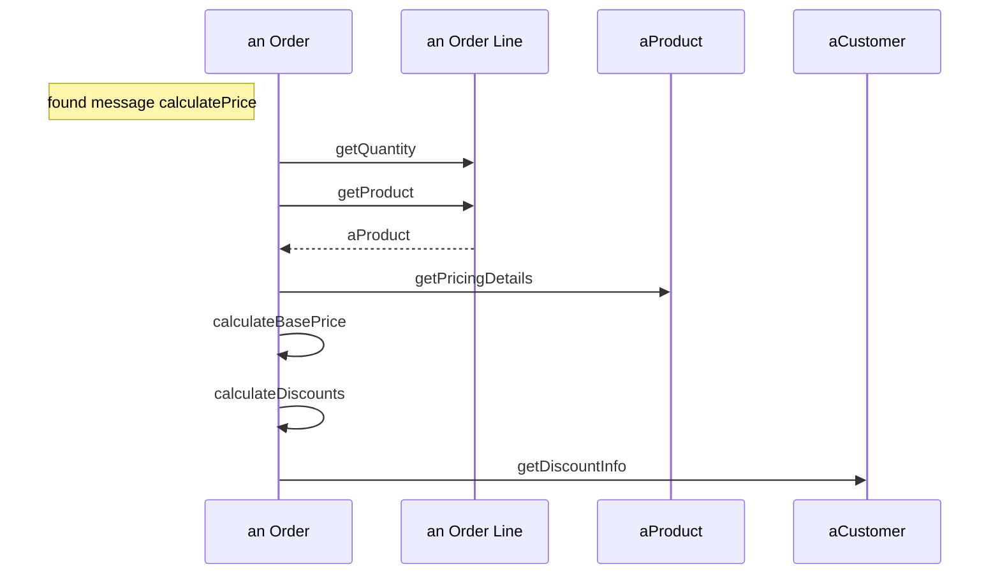

# Diagrama de secuencia UML

El diagrama de secuencia muestra la **dinámica**: qué mensajes (llamadas a métodos) se envían los objetos **a lo largo del tiempo** para realizar una operación.

## Diagrama de secuencia
- Cada **caja** es la **instancia** de una clase (objeto).
- La **línea punteada** es la **línea de vida** de un objeto.
- Se lee **de arriba hacia abajo**.


> [!note]- Transcripción de las imágenes
> Participantes: *an Order*, *an Order Line*, *aProduct*, *aCustomer*. Un **found message** `calculatePrice` llega a *an Order*. Luego, en orden: `getQuantity` y `getProduct` a *an Order Line* (con **return** punteado `aProduct`), `getPricingDetails` a *aProduct*, dos **self-calls** (`calculateBasePrice` y `calculateDiscounts`) y `getDiscountInfo` a *aCustomer*. Se señalan: participant, lifeline, activation (rectángulo angosto), message y return.
> ```ruby
> class Order
>   def calculatePrice()
>     a = orderLine.getQuantity()
>     b = orderLine.getProduct()
>     product.getPricingDetails()
>     self calculateBasePrice()
>     self calculateDiscount()
>     customer.getDiscountInfo()
>   end
> end
> ```



## Creación y eliminación de objetos


> [!note]- Transcripción de la imagen
> *a Handler* recibe `query database` y crea con `new` (**creation**) un *a Query Command*. Este crea con `new` un *a Database Statement*, le envía `execute` y recibe `results`. Luego hace `extract results` (self-call) y `close`, que **elimina** el Database Statement (**deletion from other object**: una X al final de su línea de vida). Al final, el Query Command se elimina a sí mismo (**self-deletion**) y devuelve `results` al Handler.

> [!tip] Complemento (slides "UML" y libro del curso, cap. 8.12)
> | Elemento | Notación |
> |---|---|
> | Objeto (participante) | caja con `nombre : Clase` o "an Order" |
> | Línea de vida | línea punteada vertical |
> | Activación | rectángulo angosto: período en que el objeto está activo |
> | Mensaje (llamada) | flecha continua con punta llena |
> | Retorno | flecha punteada (normalmente solo si se retorna un objeto) |
> | Self-call | flecha que vuelve al mismo objeto |
> | Creación | mensaje `new` que apunta a la caja del nuevo objeto (más abajo) |
> | Eliminación | X al final de la línea de vida |
>
> **Cómo pasar de código a diagrama:** cada línea `objeto.metodo()` dentro del método es una flecha desde el objeto actual hasta `objeto`, en orden de arriba hacia abajo. `self.metodo` es una flecha al mismo objeto. Los ciclos y condicionales se dibujan con [[07 - Fragmentos alt y loop en diagramas de secuencia|fragmentos]].
>
> **Ejemplo del libro (biblioteca):** *aReader* envía `borrow(lector, libro)` a *aLibrarian*. Este pide `findReader` y `findBook` a *theLibrary* (que retorna los objetos) y luego crea *theBorrowing* con el lector y el libro.

## Preguntas de repaso

1. ¿Qué representan las cajas, las líneas punteadas verticales y los rectángulos angostos?
> [!question]- Respuesta
> Las cajas son objetos (instancias), las líneas punteadas son sus líneas de vida y los rectángulos angostos son los períodos de activación (cuando el objeto está ejecutando).

2. ¿Cómo se representa que un objeto se llama a sí mismo?
> [!question]- Respuesta
> Con una flecha (self-call) que sale y vuelve a la línea de vida del mismo objeto, normalmente con una activación anidada.

3. ¿Cómo se indica que un objeto se destruye?
> [!question]- Respuesta
> Con una X al final de su línea de vida.

4. En qué sentido se lee el diagrama y por qué importa.
> [!question]- Respuesta
> De arriba hacia abajo, porque el eje vertical es el tiempo: una flecha más arriba ocurre antes.
