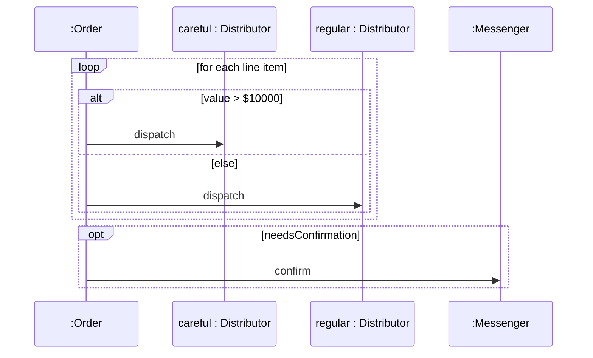

# Fragmentos alt y loop en diagramas de secuencia

Los **fragmentos combinados** (marcos o *frames*) permiten mostrar **condicionales** (`alt`, `opt`) y **ciclos** (`loop`) dentro de un diagrama de secuencia.

## Iteraciones y condicionales
- Es posible utilizar las dos notaciones: **"an Order"** o **"order1: Order"**.
- **Alt** es un **"if-then-else"**, y entre corchetes va la **condición**.
- **Loop** hace referencia a un **"for loop"**.
- El **frame (marco)** denota los mensajes que se llaman dentro del "if" o del "for".


> [!note]- Transcripción de la imagen
> Participantes: `:Order`, `careful : Distributor`, `regular : Distributor` y `:Messenger`. Llega `dispatch` a `:Order`. Un frame **`loop [for each line item]`** contiene un **`alt`** (el *operator*) con guarda **`[value > $10000]`**, que hace `dispatch` a *careful*, y **`[else]`**, que hace `dispatch` a *regular*; las dos partes se separan con una línea punteada. Después, un **`opt [needsConfirmation]`** envía `confirm` a `:Messenger`. Se señalan: operator, frame y guard.



> [!tip] Complemento — fragmentos más usados
> | Operador | Equivale a | Guarda |
> |---|---|---|
> | `alt` | `if / elsif / else` (varias partes separadas por línea punteada) | `[condición]` en cada parte, `[else]` en la última |
> | `opt` | `if` sin else | `[condición]` |
> | `loop` | `for` / `each` / `while` | `[para cada ítem]` o `[mientras …]` |
>
> El código Ruby que corresponde a la imagen sería:
> ```ruby
> def dispatch
>   line_items.each do |item|
>     if item.value > 10_000
>       careful.dispatch(item)
>     else
>       regular.dispatch(item)
>     end
>   end
>   messenger.confirm if needs_confirmation
> end
> ```

## Preguntas de repaso

1. ¿Qué fragmento representa un if-then-else y dónde va la condición?
> [!question]- Respuesta
> `alt`; la condición (guarda) va entre corchetes en cada parte, por ejemplo `[value > $10000]` y `[else]`.

2. ¿Qué diferencia hay entre `alt` y `opt`?
> [!question]- Respuesta
> `alt` tiene varias alternativas (if/else). `opt` es un solo bloque que ocurre solo si se cumple la condición (if sin else).

3. ¿Cómo dibujarías `@items.each { |i| i.precio }`?
> [!question]- Respuesta
> Con un frame `loop [para cada item]` que contenga la flecha `precio` desde el objeto actual hacia `:Item`.
