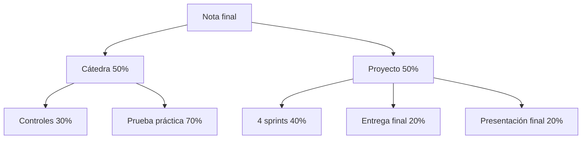

# Evaluación y calendario de IIC2143

Cómo se evaluaba el ramo cuando lo cursé (2024) y las fechas de cada evaluación. Sirve para ubicar qué contenidos entraban en cada control y en la prueba práctica.

## Evaluación (mis apuntes)
### CÁTEDRA (50% del ramo)
**Controles (30% de la nota de cátedra):**
- 25 de marzo
- 08 de abril
- 20 de mayo
- 05 de junio
- TAREA → API simple en RubyOnRails (Ruby on Rails; ver [[15 - Construir una API JSON en Rails|API JSON en Rails]])

**Prueba Práctica (70%)**
- Prueba Recuperativa (03 de Julio)

### PROYECTO (50% del ramo)
- 4 sprints → Entregas Parciales (40%)
- Entrega final → 20%
- Presentación Final → 20%

## Calendario 2024 (de mi calendario de Notion)
| Fecha | Evaluación |
|---|---|
| 25 de marzo | C1 Software |
| 5 de abril (23:59) | Sprint 0 |
| 8 de abril | C2 Software |
| 26 de abril (23:59) | Sprint 1 |
| 20 de mayo | C3 Software |
| 24 de mayo | Prueba práctica (70% de cátedra) |
| 26 de mayo | Sprint 2 |
| 5 de junio | C4 Software |
| 22 de junio – 2 de julio | Días de estudio |
| 3 de julio | Examen / prueba recuperativa |

*Lo que entraba en cada evaluación está en [[05 - Contenidos de las evaluaciones|Contenidos de las evaluaciones]].*

> [!tip] Complemento — esquema de otra versión del curso (slides de presentación, profesor J. P. Sandoval)
> En la versión de las slides (año anterior) el esquema era distinto:
> - **NI, nota de interrogaciones (50%):** promedio de la I1 (24 de abril) y la I2 (9 de junio), con recuperativo el 10 de julio. Un recuperativo dado para subir nota **reemplaza** la nota original, aunque sea menor.
> - **NP, nota de proyecto (50%):** tarea individual en RoR (10%), 4 sprints en equipo de 3 personas (50%), revisión del producto final (20%) y presentación (20%).
> - **Aprobación:** NP ≥ 3,95 **y** NI ≥ 3,95 → NF = 0,5·NI + 0,5·NP; si no, NF = mín(NI, NP). La slide dice "Si NP >= 3.95 y NP >= 3.95" por error: debe ser NI y NP.
> - **Sistema de cartas:** participar en clase daba cartas, cada una con una décima extra para alguna evaluación (máximo 5 cartas antes de cada interrogación, individuales e intransferibles).
> - **Integridad académica:** una copia significa nota 1,0 en la evaluación y, según la gravedad, 1,0 en todo el ítem o 1,1 en el curso.
>
> Las diferencias entre ambas versiones están anotadas en `_meta/DUDAS.md`.

## Preguntas de repaso

1. ¿Cuánto pesaba la prueba práctica en la nota final?
> [!question]- Respuesta
> 35%: la prueba práctica era el 70% de la cátedra, y la cátedra el 50% del ramo (0,7 × 0,5).

2. ¿Cómo se componía la nota de proyecto?
> [!question]- Respuesta
> 4 sprints (entregas parciales) 40%, entrega final 20% y presentación final 20%.

3. ¿Qué evaluación era la tarea individual?
> [!question]- Respuesta
> Una API simple en Ruby on Rails, parte de la nota de controles.
