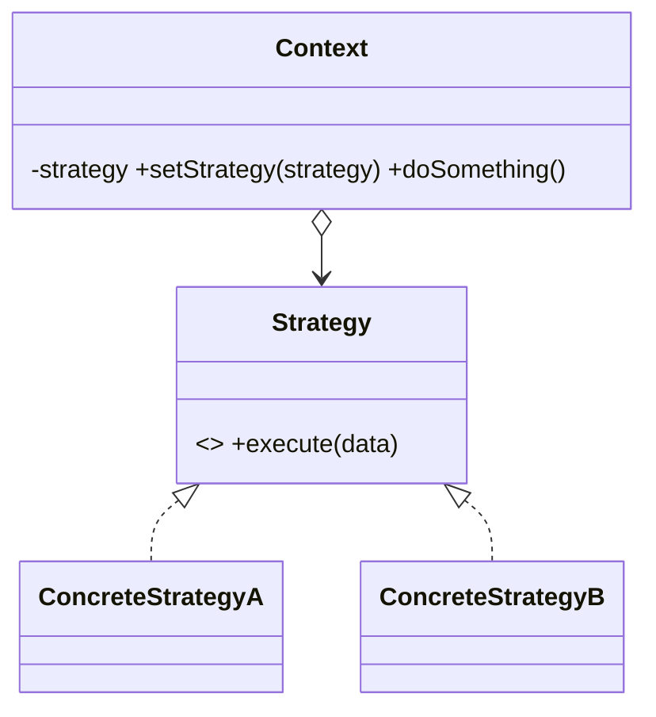

# Patrón Strategy 🧠

Strategy es un patrón de comportamiento que **encapsula cada algoritmo en su propia clase** para poder intercambiarlos. El objeto que los usa (el contexto) no sabe cuál está usando.

## Definición
- **Contexto + estrategias.**
- Patrón de diseño de comportamiento que:
  - permite definir una **familia de ALGORITMOS**,
  - colocar cada uno de ellos en una **CLASE SEPARADA**,
  - y hacer sus objetos **intercambiables**.

## Problemas
- En una app para viajeros con un mapa:
  - V1: en el mapa se automatizan las rutas sobre la carretera
  - V2: rutas a pie
  - V3: rutas en tren
  - V4: rutas en …

La clase **NAVEGADOR** →
- tiene mucha lógica de fondo,
- hacer cambios se puede volver insostenible.

## Solución
- Tomar la clase y separarla en distintas.
- Extraer todos los algoritmos y colocarlos en **CLASES SEPARADAS**.
- Cada clase será una **Estrategia**.
- La clase original será el **Contexto**.
- El cliente pasa la estrategia deseada al contexto.
- El contexto llama a un **MÉTODO COMÚN** en las estrategias.

## Ventajas
- Intercambiar algoritmos **en tiempo de ejecución**.
- **Principio abierto/cerrado** → añadir nuevas estrategias sin modificar.
- **Sustituye herencia por composición.**

## Diagrama

> [!note]- Transcripción de las imágenes
> - **Rutas:** `Navigator` (`-routeStrategy`, `+buildRoute(A, B)`, que hace `route = routeStrategy.buildRoute(A, B)`) agrega (rombo vacío) la interfaz `«interface» RouteStrategy` (`+buildRoute(A, B)`), implementada por `RoadStrategy`, `PublicTransportStrategy` y `WalkingStrategy`.
> - **Estructura general:**
>   1. El **Contexto** mantiene una referencia a una estrategia concreta y se comunica con ella solo a través de la interfaz.
>   2. La interfaz **Estrategia** es común a todas las estrategias concretas y declara el método que usa el contexto (`execute(data)`).
>   3. Las **Estrategias Concretas** implementan variaciones del algoritmo.
>   4. El contexto llama a `strategy.execute()` sin saber qué estrategia es.
>   5. El **Cliente** crea la estrategia y la pasa al contexto con `setStrategy`; puede cambiarla en tiempo de ejecución.

La implementación completa está en [[02 - Strategy - implementación en Ruby|Strategy: implementación en Ruby]] y un ejercicio de prueba en [[01 - Ejercicio - Strategy para procesador de pagos|Ejercicio: procesador de pagos]].

> [!tip] Complemento (slides "Patrones de Diseño: Comportamiento")
> - Cada algoritmo está en una clase separada, pero todas tienen **uno o más métodos públicos con la misma firma** (nombre y número de argumentos). La clase que usa las estrategias interactúa con ellas mediante esos métodos, sin saber cuál está usando.
> - Esos métodos comunes se definen en la **clase padre como "abstractos"** (en Ruby, con `raise NotImplementedError`) para obligar a las hijas a sobrescribirlos.
> - Ejemplo ya visto: [[08 - Ejemplo de diseño - Filtros de libros|filtros de libros]] (`BookStore` + `FilterStrategy`). Ejercicio de las slides: `Course` con `ImproveStrategy` (`ImproveMin`, `ImproveMax`) para subir las notas de distintas formas.
> - **Cuándo usarlo:** cuando hay varias variantes de un algoritmo y se elige entre ellas con `if` o `case`. Cada `when` pasa a ser una estrategia.

## Preguntas de repaso

1. ¿Qué problema resuelve Strategy?
> [!question]- Respuesta
> El de una clase con muchas variantes de un algoritmo (normalmente un `if`/`case` que crece), difícil de mantener y que hay que modificar para cada variante nueva.

2. ¿Cuáles son los participantes del patrón?
> [!question]- Respuesta
> El Contexto (tiene una referencia a una estrategia y llama a su método común), la interfaz Estrategia, las Estrategias Concretas y el Cliente, que elige la estrategia y se la pasa al contexto.

3. ¿Por qué se dice que "sustituye herencia por composición"?
> [!question]- Respuesta
> Porque en vez de crear subclases del contexto para cada variante, el contexto **contiene** un objeto estrategia y le delega el algoritmo; ese objeto se puede cambiar en tiempo de ejecución.

4. ¿Cómo cumple el principio abierto/cerrado?
> [!question]- Respuesta
> Agregar un algoritmo nuevo significa crear una nueva clase de estrategia, sin modificar el contexto ni las demás estrategias.
