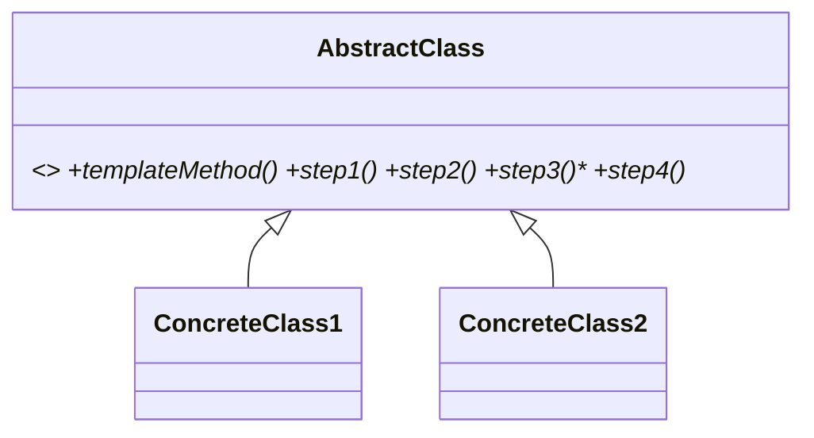

# Patrón Template Method 🦴

Template Method define en una superclase el **esqueleto de un algoritmo** (el método plantilla) y deja que las subclases **sobrescriban algunos pasos** sin cambiar la estructura.

## Definición
- Patrón que define el **esqueleto del algoritmo en una superclase**.
- Permite que las **subclases sobrescriban pasos** del algoritmo (**sin cambiar la estructura**).

## Problemas
- En una app para abrir documentos:
  - V1: solo archivos DOC
  - V2: archivos CSV
  - V3: archivos PDF
  - etc.
- **¡TENEMOS MUCHO CÓDIGO DUPLICADO!**

## Solución
- Dividir un algoritmo en varios **pasos** → cada paso es un **método**.
- La serie de llamadas a los métodos va en un **método plantilla**.
- Los pasos pueden ser **abstractos** o **tener implementación**.

Cliente →
- crea su subclase,
- implementa los pasos abstractos y sobrescribe los opcionales,
- **"NUNCA se sobrescribe el método plantilla"**.

> [!note]- Transcripción de las imágenes
> - **Problema:** `DocDataMiner`, `CSVDataMiner` y `PDFDataMiner` tienen cada uno un `mine(path)` que hace openFile → extract…Data → parse…Data → analyzeData → sendReport → closeFile. Solo cambian extract y parse, y el resto es código duplicado.
> - **Solución:** `DataMiner` tiene el **método plantilla** `mine(path)` y los **pasos** `openFile`, `extractData`, `parseData` (abstractos), además de `analyzeData` y `sendReport` (**con implementación por defecto**) y `closeFile`. `PDFDataMiner` sobrescribe solo `openFile`, `extractData`, `parseData` y `closeFile`.
> - **Estructura:**
>   1. La **Clase Abstracta** declara los pasos y el método plantilla, que los invoca en un orden específico (por ejemplo, `step1; if step2 then step3 else step4`). Los pasos pueden ser abstractos o tener una implementación por defecto.
>   2. Las **Clases Concretas** pueden sobrescribir todos los pasos, **pero no el método plantilla**.

## Ejemplo diagrama (ya visto en clase)

`CafeineBeverage` (`+prepareRecipe()`, `+boilWater()`, `+brew()`, `+pourInCups()`, `+addCondiments()`) con las hijas `Coffe` y `Tea`, que sobrescriben `brew()` y `addCondiments()`. Es el ejemplo de [[09 - Ejemplo de diseño - Bebidas con cafeína|bebidas con cafeína]] de la clase de Diseño.

Código completo: [[04 - Template Method - implementación en Ruby|Template Method: implementación en Ruby]].

> [!tip] Complemento (slides "Patrones de Diseño: Comportamiento")
> - El método de la clase padre que llama a los pasos se llama **plantilla**. Al menos uno de los pasos es abstracto, y por eso la clase es abstracta.
> - **Hooks:** pasos con implementación vacía por defecto que las hijas **pueden** sobrescribir, pero no están obligadas.
> - **Diferencia con Strategy:** Template Method varía *partes* de un algoritmo **mediante herencia**; Strategy reemplaza el algoritmo *completo* **mediante composición**. Ver [[02 - Strategy vs Template Method|Strategy vs Template Method]].

## Preguntas de repaso

1. ¿Qué es el método plantilla?
> [!question]- Respuesta
> El método de la superclase que define el esqueleto del algoritmo: llama a los pasos en un orden fijo. Las subclases no lo sobrescriben.

2. ¿Qué diferencia hay entre un paso abstracto y un hook?
> [!question]- Respuesta
> El paso abstracto (lanza `NotImplementedError`) debe implementarse en la subclase. El hook tiene una implementación por defecto (a veces vacía) y la subclase puede sobrescribirlo si quiere.

3. ¿Qué problema resolvía en el ejemplo de los data miners?
> [!question]- Respuesta
> El código duplicado entre DocDataMiner, CSVDataMiner y PDFDataMiner: los pasos comunes (analizar, reportar) quedan en la superclase y cada subclase implementa solo cómo extraer y parsear su formato.

4. ¿Por qué nunca se sobrescribe el método plantilla?
> [!question]- Respuesta
> Porque define la estructura invariable del algoritmo. Si una subclase lo cambia, se rompe la garantía de que todos siguen los mismos pasos en el mismo orden.
