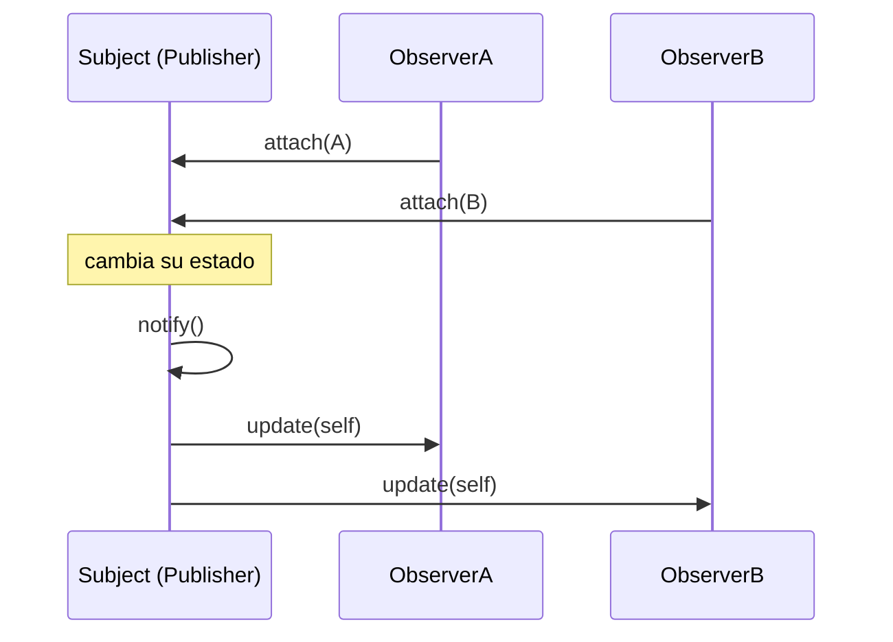

# Patrón Observer 👀

Observer define un **mecanismo de suscripción**: un objeto (el sujeto o publicador) avisa automáticamente a todos sus suscriptores cuando cambia su estado, sin necesidad de conocer sus clases.

## Definición
- Patrón que permite definir un **mecanismo de suscripción** para **notificar a varios objetos**
- sobre un **evento** que le ocurre a algún objeto.

## Problemas
- Tienda con clientes que quieren saber cuándo llegó un producto.
- El cliente puede visitar la tienda todos los días.
- La tienda podría enviar cientos de correos cada vez que haya un producto disponible.

## Participantes
- **SUJETO:** el objeto el cual tiene el estado interesante para otros.
- **NOTIFICADOR:** o publicador.
- **SUSCRIPTORES:** objetos que quieren conocer los cambios de estado del notificador.
- El patrón sugiere: **añadir un método de suscripción** a la clase notificadora.

## Ventajas
- **Principio abierto/cerrado** → introducir nuevas clases suscriptoras sin modificar código.
- Se pueden establecer relaciones entre objetos **durante el tiempo de ejecución**.

> [!note]- Transcripción de las imágenes
> - *Visita a la tienda vs. envío de spam:* o el cliente va todos los días a la tienda a ver si llegó el producto, o la tienda manda correos a todos (la mayoría responde "WTF!?" y solo uno "¡HURRA!").
> - *Mecanismo de suscripción:* `Publisher` (`-subscribers[]`, `+addSubscriber(subscriber)`, `+removeSubscriber(subscriber)`). Los `Subscriber` dicen "¡Hey! ¡Apúntame, por favor!" y "¡A mí también!".
> - *Notificación:* `Publisher.notifySubscribers()` llama a `update()` en cada `Subscriber` de su lista: "Chicos, sólo quería decirles que me acaba de pasar algo".

Código completo: [[06 - Observer - implementación en Ruby|Observer: implementación en Ruby]]. Ejercicio de prueba: [[02 - Ejercicio - Observer de empleados con diagrama de secuencia|Observer de empleados]].

> [!tip] Complemento (slides "Patrones de Diseño: Comportamiento")
> - Cada vez que cambia el estado observado, se notifica a **todos los observadores sin importar su tipo**, mandándoles la información que necesiten. Cada observador decide qué hacer con ella.
> - El objeto observado **no sabe qué hacen los observadores**: así es más independiente y **se reduce el acoplamiento**.
> - **Ejemplo de las slides, "Cola Virtual":** un `release()` recorría tres listas (`onlyOneSubscriber`, `lastTenSubscriber`, `alwaysSubscriber`) con un `if` distinto para cada una. La versión mejorada (`VirtualQueue` con `register(subscriptor)` y `notifyAll`, y un `Subscriptor` abstracto con `update(queue)` implementado por `OnlyOneSubscriber`, `LastTenSubscriber` y `AlwaysSubscriber`) deja que cada suscriptor decida si avisar.
> - **Usos típicos:** eventos de interfaz (clic), notificaciones, *callbacks* de Rails (`after_save`), el modelo publicar/suscribir.

## Preguntas de repaso

1. ¿Qué problema resuelve Observer?
> [!question]- Respuesta
> Avisar a varios objetos interesados cuando cambia el estado de otro, sin que tengan que preguntar constantemente (polling) y sin que el sujeto conozca sus clases concretas.

2. ¿Qué métodos tiene típicamente el sujeto?
> [!question]- Respuesta
> `attach` (o `addSubscriber`), `detach` (o `removeSubscriber`) y `notify`, que llama a `update` en cada observador.

3. ¿Por qué Observer reduce el acoplamiento?
> [!question]- Respuesta
> Porque el sujeto solo sabe que sus observadores responden a `update`; no conoce sus clases ni lo que hacen. Se pueden agregar observadores nuevos sin modificarlo.

4. ¿Qué significa que las relaciones se establezcan "en tiempo de ejecución"?
> [!question]- Respuesta
> Que los observadores se pueden suscribir y desuscribir mientras el programa corre (`attach`/`detach`), en vez de quedar fijados en el código.
