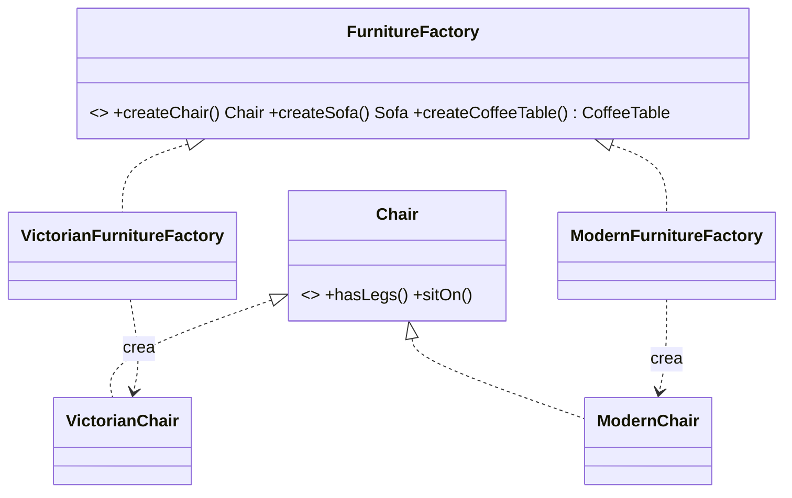

# Patrón Abstract Factory 🤖

Abstract Factory permite **crear familias de objetos relacionados** (por ejemplo, silla + sofá + mesa de un mismo estilo) **sin especificar sus clases concretas**: el cliente pide los productos a una fábrica y la fábrica concreta decide la variante.

## Definición
- Nos permite producir **familias de objetos relacionados sin especificar clases concretas**.
- Ej.: familia de productos: **silla + sofá + mesa**.
- **REQUISITO:** no cambiar código existente al añadir productos o familias.

## Mecanismo
- Crear una **interfaz para cada producto** diferente de la familia de productos.
- Todas las variantes del producto seguirán esa interfaz.
- Declaramos la **FÁBRICA ABSTRACTA**: interfaz de métodos de creación para todos los productos de una familia.
- Los métodos devuelven **productos abstractos**.

> [!note]- Transcripción de las imágenes
> - `«interface» Chair` (`+hasLegs()`, `+sitOn()`), implementada por `VictorianChair` y `ModernChair`.
> - `«interface» FurnitureFactory` (`+createChair(): Chair`, `+createCoffeeTable(): CoffeeTable`, `+createSofa(): Sofa`), implementada por `VictorianFurnitureFactory` y `ModernFurnitureFactory`. *Cada fábrica concreta corresponde a una variante específica del producto.*

Código completo: [[02 - Abstract Factory - implementación en Ruby|Abstract Factory: implementación en Ruby]].

> [!tip] Complemento — cuándo usarlo
> - Cuando el código debe funcionar con **varias familias** de productos que deben combinarse entre sí (no mezclar una silla victoriana con un sofá moderno) y no quieres depender de sus clases concretas. Por ejemplo, componentes de interfaz para Windows o macOS, o conectores para PostgreSQL o MySQL.
> - **Agregar una familia nueva** (por ejemplo, Art Déco) = una fábrica concreta nueva más sus productos, sin tocar el cliente.
> - **Agregar un tipo de producto nuevo** (por ejemplo, Lámpara) **sí** obliga a modificar la interfaz de la fábrica y todas las fábricas concretas. Es la debilidad del patrón.
> - Comparación: [[04 - Factory Method vs Abstract Factory|Factory Method vs Abstract Factory]].

## Preguntas de repaso

1. ¿Qué problema resuelve Abstract Factory?
> [!question]- Respuesta
> Crear familias de objetos relacionados que deben usarse juntos, sin que el cliente dependa de sus clases concretas.

2. ¿Qué contiene la fábrica abstracta?
> [!question]- Respuesta
> Un método de creación por cada producto de la familia (`createChair`, `createSofa`…), cada uno devolviendo un producto abstracto.

3. ¿Qué es fácil y qué es difícil de extender con este patrón?
> [!question]- Respuesta
> Es fácil agregar una familia nueva (otra fábrica concreta). Es difícil agregar un tipo de producto nuevo, porque hay que cambiar la interfaz y todas las fábricas.
