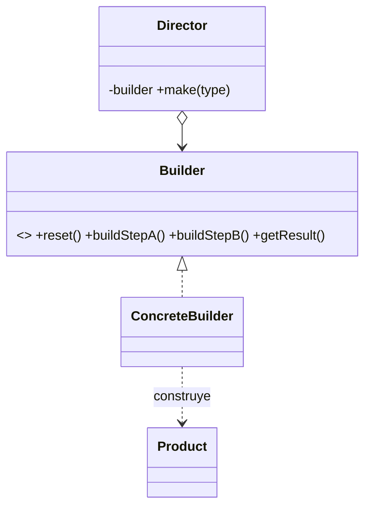

# Patrón Builder 🔨

Builder permite **construir objetos complejos paso a paso**, separando el código de construcción del objeto en sí. Con el mismo proceso se obtienen distintas representaciones.

## Definición
- Nos permite construir **objetos complejos paso a paso**.
- Nos permite producir **distintos tipos y representaciones** de un objeto.
- Ej.: queremos diferentes tipos de casas con atributos distintos → **¡muchas subclases!**

## Solución
- Sacar el código de construcción del objeto de su propia clase.
- Colocarlo dentro de **objetos independientes** → los llamaremos **CONSTRUCTORES**.

- **Builder:** declara los métodos de construcción que deben implementarse para crear partes del producto.
- **ConcreteBuilder:** implementa los métodos de construcción para ensamblar y construir partes del producto.
- **Product:** representa el objeto complejo que se está construyendo.
- **Director:** dirige el proceso de construcción utilizando el builder.
- **Client:** crea un builder, lo pasa al director y obtiene el producto resultante.

> [!note]- Transcripción de las imágenes
> - **Casas:** `House` con subclases `HouseWithGarage`, `HouseWithSwimmingPool`, `HouseWithFancyStatues` y `HouseWithGarden`. *"Crear una subclase por cada configuración posible de un objeto puede complicar demasiado el programa."*
> - **Estructura:** `«interface» Builder` (`+reset()`, `+buildStepA()`, `+buildStepB()`, `+buildStepZ()`) implementada por `ConcreteBuilder1` (`-result: Product1`, … `+getResult(): Product1`) y `ConcreteBuilder2`. `Director` (`-builder: Builder`, `+Director(builder)`, `+changeBuilder(builder)`, `+make(type)`): `builder.reset(); if (type == "simple") { builder.buildStepA() } else { builder.buildStepB(); builder.buildStepZ() }`. El `Client` hace `d.make()` y luego `p = b.getResult()`.

Código completo: [[04 - Builder - implementación en Ruby|Builder: implementación en Ruby]].

> [!tip] Complemento — cuándo usarlo
> - Cuando un objeto tiene **muchas partes opcionales** y un constructor con 10 parámetros sería ilegible (el "constructor telescópico").
> - Cuando se necesitan **distintas representaciones** con el mismo proceso: por ejemplo, el mismo Director arma una casa de madera o de piedra según el builder que reciba.
> - El **Director es opcional**: el cliente puede llamar los pasos del builder directamente (como en el "producto personalizado" del ejemplo de código).
> - En Rails se ve una idea parecida en las consultas encadenadas: `Student.where(...).order(...).limit(5)`.

## Preguntas de repaso

1. ¿Qué problema resuelve Builder?
> [!question]- Respuesta
> Construir objetos complejos con muchas configuraciones sin crear una subclase por combinación ni constructores gigantes: la construcción se hace paso a paso en un objeto aparte.

2. ¿Qué hace el Director y es obligatorio?
> [!question]- Respuesta
> Define el orden de los pasos para construir configuraciones típicas (producto mínimo, completo). No es obligatorio: el cliente puede invocar los pasos del builder directamente.

3. ¿Quién entrega el producto terminado?
> [!question]- Respuesta
> El builder concreto, con `getResult()` (en el ejemplo, `obtener_producto`).
