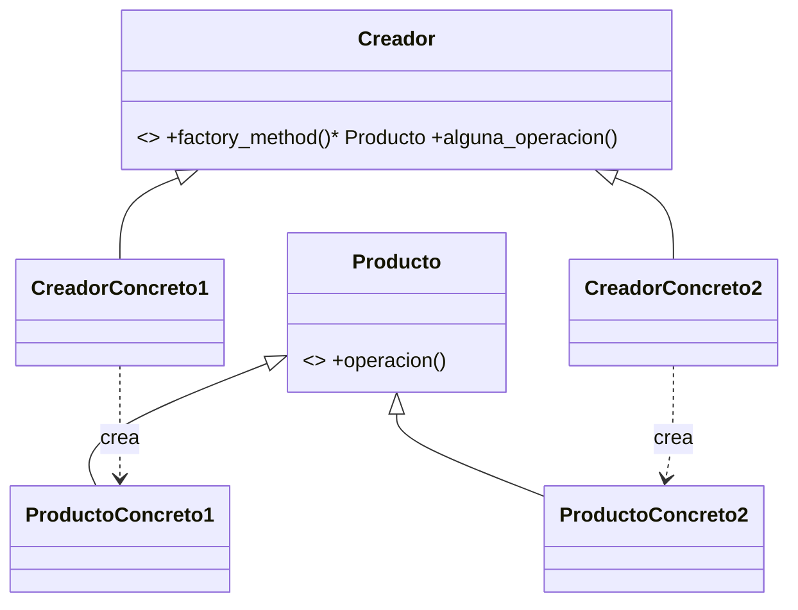

# Patrón Factory Method (Factory)

Factory Method define en una superclase un **método que crea objetos** (el método fábrica) y deja que **las subclases decidan qué clase concreta crear**. El resto del código de la superclase trabaja con el producto sin saber su clase.

## Definición
- Proporciona una **interfaz para crear objetos en una superclase**,
- mientras permite a las **subclases alterar el tipo de objetos** que se crearán.
- En vez de utilizar **"new"** para construir objetos, utilizamos el **método "Fábrica"**.

- **Producto (Product):** declara la interfaz de los objetos que la fábrica crea.
- **ProductoConcreto (ConcreteProduct):** implementa la interfaz del producto.
- **Creador (Creator):** declara el método factory que devuelve un objeto de tipo Producto.
- **CreadorConcreto (ConcreteCreator):** sobrescribe el método factory para devolver instancias de ProductoConcreto.

> [!note]- Transcripción de la imagen
> `Creator` (`+someOperation()`, `+createProduct(): Product` en cursiva, es decir, abstracto) con subclases `ConcreteCreatorA` y `ConcreteCreatorB` (`+createProduct(): Product`, que hace `return new ConcreteProductA()`). `«interface» Product` (`+doStuff()`) implementada por `ConcreteProductA` y `ConcreteProductB`. *Los productos concretos son distintas implementaciones de la interfaz de producto.*

Código completo: [[06 - Factory Method - implementación en Ruby|Factory Method: implementación en Ruby]].

> [!tip] Complemento
> - Es **Template Method aplicado a la creación**: `alguna_operacion` es la plantilla y `factory_method` es el paso que define cada subclase.
> - **Ejemplo típico:** una app de logística cuyo `Logistica#planificar_entrega` usa `crear_transporte`. `LogisticaTerrestre` devuelve un `Camion` y `LogisticaMaritima` un `Barco`. El código de planificación no cambia.
> - **No confundir** con un simple método de clase que crea objetos (`Person.create_male(...)`): en Factory Method la clave es que **las subclases sobrescriben** el método de creación.
> - Comparación: [[04 - Factory Method vs Abstract Factory|Factory Method vs Abstract Factory]].

## Preguntas de repaso

1. ¿Qué es el "método fábrica"?
> [!question]- Respuesta
> Un método de la superclase (abstracto o con implementación por defecto) que devuelve un Producto. Las subclases lo sobrescriben para crear el producto concreto que corresponda.

2. ¿Por qué se usa el método fábrica en vez de `new`?
> [!question]- Respuesta
> Porque `new` amarra el código a una clase concreta. Con el método fábrica, la superclase trabaja con la interfaz Producto y cada subclase decide qué clase crear.

3. ¿Qué hay que hacer para agregar un nuevo tipo de producto?
> [!question]- Respuesta
> Crear un `ProductoConcreto3` y un `CreadorConcreto3` que sobrescriba `factory_method`. No se modifica `Creador`.
