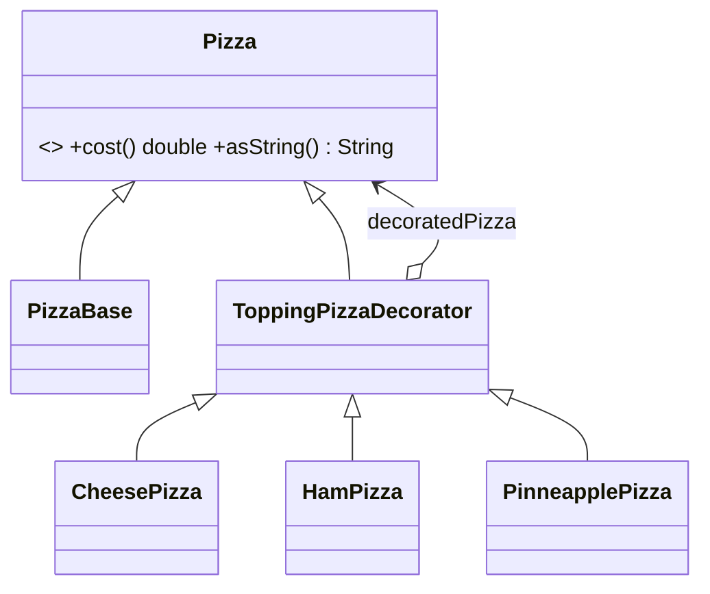

# Patrón Decorator 🍕

Decorator **agrega funcionalidades a un objeto envolviéndolo** en otros objetos (decoradores) que tienen la misma interfaz. Cada decorador delega en el objeto envuelto y suma su propio comportamiento.

## Definición
- Permite **AÑADIR FUNCIONALIDADES** a objetos,
- colocando estos dentro de otros **objetos encapsuladores** que contienen esas funcionalidades.

## Problemática
- App de notificaciones: solo se envían por un canal.
- ¿Qué pasa si quiero recibir en **varios canales**?

## Solución
- Añadir **composición**: un objeto tiene referencia a otro y le **delega** trabajo.
- El **objeto decorador** tiene como atributo al **objeto decorado**.
- Cuando un método del objeto decorado es llamado, el decorador **llama al método del decorado y luego realiza acciones adicionales**.

> [!note]- Transcripción de las imágenes
> - **Analogía:** una persona con frío; con un suéter; con un suéter y una parca para la lluvia. Cada prenda "envuelve" a la anterior.
> - **Explosión combinatoria:** `Notifier` con subclases `SMS`, `Facebook`, `Slack`, `SMS+Slack`, `SMS+Facebook`, `Facebook+Slack`, `SMS+Facebook+Slack`… Hace falta una subclase por cada combinación.
> - **Solución:** `Notifier` (`+send(message)`) ← `BaseDecorator` (`-wrappee: Notifier`, `+BaseDecorator(notifier)`, `+send(message)` que hace `wrappee.send(message)`) ← `SMSDecorator`, `FacebookDecorator` y `SlackDecorator`, cuyo `send` hace `super::send(message); sendSMS(message)`.
> - **Pros:** extender el comportamiento sin crear subclases; añadir o quitar responsabilidades en tiempo de ejecución; combinar comportamientos apilando decoradores; principio de responsabilidad única.
> - **Contras:** es difícil quitar un wrapper específico de la pila; es difícil que el comportamiento no dependa del orden de la pila; el código de configuración inicial puede verse feo.

## Ejemplo
Supongamos que quiero vender una pizza y tenemos el código:

## Solución
- Herencia y dependencia.

> [!note]- Transcripción del ejemplo de la pizza
> - **Antes:** `Pizza` abstracta (`print` y `cost` lanzan `NotImplementedError`). `PineableHamCheesePizza < Pizza` imprime "normal bred, cheese, ham, pineapple" y su costo es `(20 + 5 + 5) * 2` (cada porción de piña duplica el costo). *Los toppings se agregan de manera estática: para una pizza de doble queso hay que crear otra clase, y hay código duplicado entre los tipos de pizza.*
> - **Después (UML):** `<<abstract>> Pizza` (`+cost(): double`, `+asString(): String`) ← `PizzaBase` y ← `ToppingPizzaDecorator` (`-decoratedPizza`, que apunta a `Pizza`) ← `CheesePizza`, `HamPizza` y `PinneapplePizza`.

> [!warning] Posible imprecisión (registrado en `_meta/DUDAS.md`)
> "Herencia y dependencia": en el diagrama, los decoradores **heredan** de `Pizza` (para tener su misma interfaz) y además **contienen** una `Pizza` (`decoratedPizza`). Esa segunda relación es **composición/agregación** (un atributo), no una dependencia temporal.

Ejercicio de prueba: [[03 - Ejercicio - Decorator de ropa y temperatura corporal|Decorator de ropa y temperatura]].

> [!tip] Complemento (slides "Patrones de Diseño: Estructurales")
> - El decorador tiene **los mismos métodos** que el decorado, así que el cliente no distingue si habla con el objeto original o con uno decorado.
> - El **decorador base** (`ToppingPizzaDecorator`) no agrega nada: solo delega. Cada decorador concreto suma algo. Por ejemplo, el de queso imprime lo mismo que la pizza decorada más "cheese" y cuesta lo mismo más 5; el de piña agrega "piña" y **multiplica** el costo por 2.
> - Así se pueden crear **todas las combinaciones sin clases nuevas**: con 4 ingredientes no hacen falta 24 clases. Por ejemplo, `CheesePizza.new(CheesePizza.new(PizzaBase.new))` es doble queso.
> - **Ojo con el orden:** `PinneapplePizza.new(CheesePizza.new(base))` cuesta (25 + 5) × 2 = 60, pero `CheesePizza.new(PinneapplePizza.new(base))` cuesta 25 × 2 + 5 = 55.

## Preguntas de repaso

1. ¿Qué problema resuelve Decorator?
> [!question]- Respuesta
> La explosión de subclases al querer combinar comportamientos (SMS+Slack, doble queso + jamón…). Permite agregar responsabilidades a un objeto dinámicamente, apilando decoradores.

2. ¿Qué relación tiene un decorador con el objeto decorado?
> [!question]- Respuesta
> Tiene la misma interfaz (hereda de la misma clase base o interfaz) y lo contiene como atributo; delega en él y agrega comportamiento antes o después.

3. ¿Por qué el orden de los decoradores puede cambiar el resultado?
> [!question]- Respuesta
> Porque cada decorador opera sobre el resultado del que envuelve. Por ejemplo, multiplicar por 2 y luego sumar 5 no da lo mismo que sumar 5 y luego multiplicar.

4. ¿Qué diferencia hay entre Decorator y herencia simple para agregar funcionalidad?
> [!question]- Respuesta
> La herencia fija el comportamiento al compilar y obliga a crear una clase por combinación. Decorator lo combina en tiempo de ejecución envolviendo objetos (composición).
