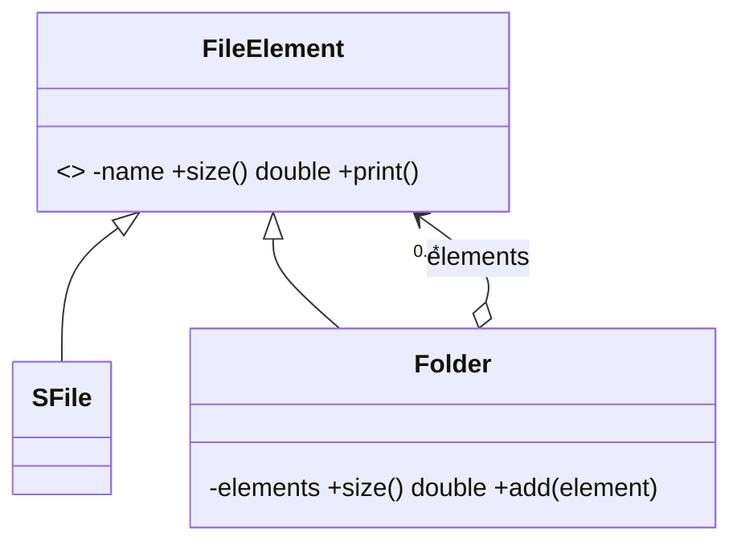

# Patrón Composite 🌿

Composite permite **componer objetos en estructuras de árbol** y tratar igual a un objeto individual (hoja) y a un grupo de objetos (compuesto).

## Definición
- Patrón de diseño estructural que te permite **componer objetos en estructuras de árbol**.
- Trabaja con esas estructuras **como si fueran objetos individuales**.


- Este patrón **solo tiene sentido si tenemos una estructura de árbol**.
- Por ejemplo: un paquete tiene cajas y objetos, y una caja puede tener otra caja hasta llegar a un producto.


## Forma de actuar: recursiva
- Para el **producto**, devuelve el precio.
- Para una **caja**, recorre cada artículo dentro y devuelve un total por caja.
- Si uno de estos artículos es una caja, esa caja también repasa su contenido, y así sucesivamente.


> [!note]- Transcripción de las imágenes
> - **Línea de mando:** un general manda a oficiales, que mandan a soldados.
> - **Pedido complejo:** una caja FEDEX contiene un martillo, un recibo y otras cajas, que a su vez contienen un teléfono, audífonos y un cargador.
> - **Sistema de archivos:** `<<abstract>> FileElement` (`-name`, `+size(): double`, `+print(): void`) ← `SFile` (`-size`, `+size(): double`, `+print(): String`) y ← `Folder` (`-elements`, `+cost(): double` [sic, debería ser `size`], `+print(): void`, `+add(element): void`). `Folder` agrega `FileElement` (rombo vacío).



> [!tip] Complemento (slides "Patrones de Diseño: Estructurales")
> - Cada objeto de la estructura puede tratarse como un **sub-árbol** o como un **objeto individual**. En la línea de mando del ejercicio de clase, cada rango tiene a su cargo elementos de menor rango; los únicos que no tienen a nadie a cargo son los **soldados rasos**, los únicos elementos no compuestos (hojas).
> - Los métodos de la **hoja** resuelven la tarea de forma independiente. Los del **compuesto** la resuelven llamando al **mismo método en sus sub-elementos** (recursión).
>
> ```ruby
> class FileElement
>   attr_reader :name
>   def initialize(name)
>     @name = name
>   end
>   def size
>     raise NotImplementedError
>   end
> end
>
> class SFile < FileElement
>   def initialize(name, size)
>     super(name)
>     @size = size
>   end
>   def size                      # hoja: responde sola
>     @size
>   end
> end
>
> class Folder < FileElement
>   def initialize(name)
>     super(name)
>     @elements = []
>   end
>   def add(element)
>     @elements << element
>   end
>   def size                      # compuesto: delega en sus hijos
>     @elements.sum(&:size)
>   end
> end
>
> root = Folder.new("root")
> docs = Folder.new("docs")
> docs.add(SFile.new("cv.pdf", 2))
> root.add(docs)
> root.add(SFile.new("foto.png", 5))
> root.size   # => 7
> ```

## Preguntas de repaso

1. ¿Cuándo tiene sentido usar Composite?
> [!question]- Respuesta
> Solo cuando el modelo tiene forma de árbol: elementos que pueden contener otros elementos del mismo tipo (cajas dentro de cajas, carpetas dentro de carpetas).

2. ¿Cómo calcula el precio una caja en el ejemplo del pedido?
> [!question]- Respuesta
> Recursivamente: recorre sus artículos y suma sus precios. Si un artículo es otra caja, esa caja hace lo mismo con su contenido.

3. ¿Qué ventaja tiene para el cliente que hoja y compuesto compartan la interfaz?
> [!question]- Respuesta
> El cliente llama a `size` o `price` sin preguntar si es un archivo o una carpeta; la recursión queda escondida en el compuesto.
