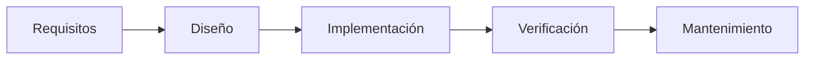

# Modelo en cascada

El modelo en cascada es un proceso **secuencial lineal**: cada etapa se hace una sola vez, en orden, y la siguiente parte de lo que entregó la anterior.

## Idea central
- Cada etapa se ejecuta **solo una vez** (**SECUENCIA LINEAL**) y son **etapas interdependientes**.

Versión en texto del diagrama:

## Ventajas
- **Simplicidad** conceptual
- **Claridad** en fases
- **Seguimiento**

## Desventajas
- **No Feedback**
- **Alto Riesgo** hasta etapas avanzadas del proyecto
- **Cambios Difíciles**, es rígido

> [!tip] Complemento (slides "Procesos de Desarrollo de Software" y libro del curso, cap. 2)
> - Es el primer modelo de proceso. Se atribuye a **Winston Royce, 1970** (*"Managing the Development of Large Software Systems"*).
> - Que las etapas sean interdependientes significa que **cada etapa depende de la anterior**: sus salidas son las entradas de la siguiente.
> - **Por qué fue tan popular** (libro): se parece a los procesos de manufactura o construcción, cada fase tiene entradas y salidas definidas, facilita asignar recursos y permite estimar cuánto falta.
> - **Desventajas según las slides:** no considera retroalimentación; es muy difícil incorporar cambios; es muy rígido, porque no es realista dar por definitivos los resultados de cada etapa; y **dilata la reducción del riesgo**.
> - **Por qué abandonarlo** (libro): su eficacia es cuestionable salvo en proyectos muy breves, los requisitos iniciales rara vez se conocen completos y, aunque se conozcan, cambian durante el proyecto.
>
> 
> *Analogía de las slides: se planifica toda la zanja, se cava, se rellena y se instala. Solo al final se ve si calzaba.*

> [!example] Ejemplo extra — lo que pasa en la práctica (slides)
> En la realidad, al diseñar o al probar se descubren problemas de etapas anteriores y hay que **volver atrás** (flechas rojas). La cascada "pura" casi nunca se cumple.
>
> 
>
> Dato histórico: el mismo artículo de Royce advierte que hacer cada etapa una sola vez es riesgoso y propone agregar retroalimentación entre etapas.

> [!tip] Complemento — cuándo sí y cuándo no
> - **Puede servir:** proyectos cortos, con requisitos estables y bien conocidos, o con exigencias regulatorias de documentación por etapa.
> - **No conviene:** requisitos inciertos o que cambian, o cuando el cliente necesita ver avances temprano. En esos casos sirven mejor los [[03 - Procesos iterativos|Procesos iterativos]] o los [[08 - Procesos iterativos e incrementales|Procesos iterativos e incrementales]].
> - **Error común:** confundir "tiene etapas" con "es cascada". Casi todos los procesos tienen etapas; lo que define a la cascada es que **cada etapa se recorre una sola vez y en orden**.

## Preguntas de repaso

1. ¿Qué caracteriza al modelo en cascada?
> [!question]- Respuesta
> Es una secuencia lineal de etapas interdependientes en la que cada etapa se ejecuta una sola vez y en orden (requisitos → diseño → implementación → verificación → mantenimiento).

2. Nombra sus ventajas y desventajas según los apuntes.
> [!question]- Respuesta
> Ventajas: simplicidad conceptual, claridad en las fases y seguimiento. Desventajas: no hay feedback, el riesgo es alto hasta etapas avanzadas y los cambios son difíciles (es rígido).

3. ¿Por qué se dice que la cascada "dilata la reducción del riesgo"?
> [!question]- Respuesta
> Porque no hay software funcionando ni feedback del usuario hasta las etapas finales. Los errores de requisitos o de diseño se descubren tarde, cuando corregirlos es más caro.

4. ¿En qué tipo de proyecto todavía podría tener sentido usar cascada?
> [!question]- Respuesta
> En proyectos cortos, con requisitos estables y bien conocidos desde el inicio, o donde se exige documentación formal por etapa.
