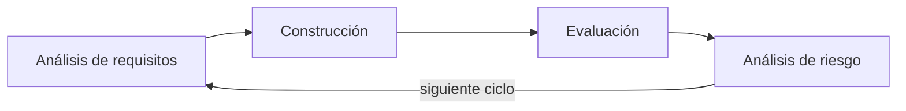

# Modelo en espiral

El modelo en espiral es un proceso **iterativo** que avanza en ciclos y, en cada ciclo, hace un **análisis de riesgo explícito**.

## Características
- Opera en **ciclos** y **fases iterativas**.
- **Consideraciones de riesgo explícitas**.

### 4 fases (en cada ciclo)
1. Análisis de requisitos
2. Construcción
3. Evaluación
4. Análisis de riesgo

Versión en texto (cada vuelta de la espiral repite las fases):

## Ventajas
- **Manejo de riesgo**
- **Flexibilidad**: se pueden presentar cambios
- Involucra **retroalimentación del cliente**

## Desventajas
- **Manejo del tiempo**: el n° de fases es desconocido
- Difícil de **estimar tiempo** del proyecto
- **Inversión importante** de planeación y análisis de riesgo

> [!tip] Complemento (slides "Procesos de Desarrollo de Software" y libro del curso, cap. 2.3)
> - Propuesto por **Barry Boehm (1986)**. Las slides lo presentan como *"una mejora al modelo en cascada"*.
> - Fue el **primer modelo en hacer explícito el análisis de riesgo**. También introdujo la noción de proceso iterativo y de prototipos, y hace explícita la repetición de actividades.
> - **Los cuadrantes de la imagen**, según el libro:
>   - **Determinar objetivos:** se recopilan los requisitos del cliente.
>   - **Evaluar riesgos (identificación y resolución):** se evalúan las posibles soluciones y se elige la más adecuada.
>   - **Desarrollar y probar:** se desarrollan y prueban las funcionalidades; al final se libera una nueva versión.
>   - **Planificar:** el cliente evalúa la versión y se planifica la siguiente iteración.
> - Ventaja extra (libro): se puede desarrollar por partes, manejando el riesgo de cada parte por separado.
> - Desventaja extra (libro): el éxito **depende mucho de la calidad del análisis de riesgo**.

> [!tip] Complemento — cuándo usarlo
> - **Conviene:** proyectos grandes, costosos o con mucha incertidumbre técnica, donde equivocarse sale caro y vale la pena invertir en analizar riesgos.
> - **No conviene:** proyectos pequeños o de bajo riesgo; el costo de planificar y analizar riesgos no se justifica.
> - **Comparación:** a diferencia de la [[Modelo en cascada|cascada]], el riesgo se ataca en cada vuelta y no recién al final. A diferencia de los [[Procesos iterativos e incrementales]], una vuelta no necesariamente entrega funcionalidad usable.

## Preguntas de repaso

1. ¿Cuál fue el principal aporte del modelo en espiral respecto de la cascada?
> [!question]- Respuesta
> Introducir consideraciones de riesgo explícitas en cada ciclo, además de trabajar en ciclos iterativos en vez de una sola pasada.

2. ¿Cuáles son las 4 fases de cada ciclo según los apuntes?
> [!question]- Respuesta
> Análisis de requisitos, construcción, evaluación y análisis de riesgo.

3. ¿Por qué es difícil estimar el tiempo de un proyecto en espiral?
> [!question]- Respuesta
> Porque el número de fases (vueltas de la espiral) no se conoce de antemano: depende de los riesgos y de los cambios que aparezcan.

4. Nombra dos ventajas y dos desventajas.
> [!question]- Respuesta
> Ventajas: manejo de riesgo, flexibilidad ante cambios y retroalimentación del cliente. Desventajas: manejo del tiempo y estimación difíciles, y una inversión importante en planeación y análisis de riesgo.
