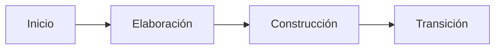

# Proceso unificado (RUP)

El Proceso Unificado es un proceso **iterativo** muy completo y formal, organizado en **4 fases** y guiado por casos de uso, arquitectura y riesgos.

## Características
- ¡Tiene su propio lenguaje! → (**UML**)

> [!warning] Posible error / precisión
> UML (*Unified Modeling Language*) **no es exclusivo** del Proceso Unificado. Es un lenguaje de modelado de propósito general, estandarizado por el OMG, que se usa con cualquier proceso. Lo crearon los mismos autores (Booch, Rumbaugh y Jacobson, en Rational), y por eso ambos aparecen juntos en las slides ("Lenguaje del Modelo Unificado"). Registrado en `_meta/DUDAS.md`.

- Contempla **cuatro fases**:
  1. **Inicio:** establecimiento de casos, viabilidad.
  2. **Elaboración:** verificación de la capacidad para construir el sistema.
  3. **Construcción:** edificación de un sistema que funcione (**VERSIÓN BETA**).
  4. **Transición:** entrega de un sistema completamente funcional a los usuarios.

## Ventajas
- Dirigido a **casos de uso**
- Centrado en la **arquitectura**
- Enfocado a **riesgos críticos** del proyecto

## Desventajas
- Mucho **énfasis en documentación**
- **Costoso** de implementar
- **Gestión y supervisión** alta
- **Iterativo pero no siempre incremental** → limita la adaptabilidad

> [!tip] Complemento (libro del curso, cap. 2.3)
> - Antes se llamaba **RUP** (*Rational Unified Process*).
> - **Cómo leer la imagen:** las columnas son las fases (Inception, Elaboration, Construction, Transition), divididas en iteraciones (I1, E1, C1…Cn, T1, T2). Las filas son **disciplinas** o *workflows* (modelado, implementación, pruebas, despliegue, gestión de configuración, gestión de proyecto, entorno). El alto de cada curva indica **cuánto se trabaja** esa disciplina en cada momento. Por ejemplo, el modelado es fuerte en Inicio y Elaboración, y la implementación es fuerte en Construcción. En todas las fases se hace un poco de todo, pero con distinta intensidad.
> - **Cada fase puede tener varias iteraciones** hasta cumplir su objetivo.
> - Define con mucho detalle los *workflows*, roles, artefactos de entrada y de salida. Fue uno de los primeros intentos de un proceso iterativo completo.
> - **Mitigación temprana del riesgo:** desarrolla primero los casos de uso más riesgosos, en vez de esperar a etapas avanzadas como en la [[Modelo en cascada|cascada]].
> - **Desafíos:** es complejo para equipos pequeños (una persona puede tener que asumir varios roles). Además, al no ser siempre incremental, encaja mal con las [[Metodologías ágiles y manifiesto ágil|metodologías ágiles]].

## Preguntas de repaso

1. ¿Cuáles son las 4 fases del Proceso Unificado y el objetivo de cada una?
> [!question]- Respuesta
> Inicio (caso de negocio y viabilidad), Elaboración (verificar que se puede construir el sistema), Construcción (construir un sistema que funcione, versión beta) y Transición (entregar el sistema completamente funcional a los usuarios).

2. ¿Por qué se dice que RUP es "iterativo pero no siempre incremental" y qué consecuencia tiene?
> [!question]- Respuesta
> Porque cada fase se recorre en iteraciones, pero esas iteraciones no siempre entregan funcionalidad nueva y usable. Eso limita su adaptabilidad frente a los procesos ágiles.

3. En el diagrama de RUP, ¿qué representa la altura de cada curva?
> [!question]- Respuesta
> La intensidad del trabajo en esa disciplina (modelado, implementación, pruebas, etc.) en cada fase o iteración.

4. ¿Es UML parte exclusiva de RUP?
> [!question]- Respuesta
> No. UML es un lenguaje de modelado general, estandarizado por el OMG, que se puede usar con cualquier proceso; RUP lo adopta como su notación.
