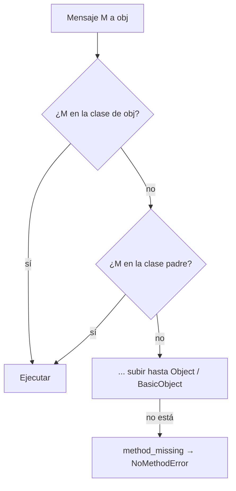

# Method lookup en Ruby

El *method lookup* es el **algoritmo que decide qué método se ejecuta** cuando un objeto recibe un mensaje: busca en su clase y luego sube por la jerarquía.

## Lookup
**Algoritmo básico de búsqueda:**
1. Buscar el método M en la lista de métodos de instancia dentro de la **clase del objeto**.
2. Si no lo encuentra, buscar el método M en la **clase padre, recursivamente**.
3. Si luego de buscar en toda la jerarquía el método no se encuentra, se invoca a **`method_missing`**.



> [!tip] Complemento (slides "Object Oriented Programming")
> - Es el algoritmo de la mayoría de los lenguajes orientados a objetos. `method_missing`, por defecto, **lanza un error** (`NoMethodError`).
> - Ruby tiene pasos adicionales, por ejemplo cuando se usan **módulos**: un módulo incluido se busca justo después de la clase que lo incluye. **En el curso se usa el algoritmo básico de arriba.**
> - Ver cómo cambia el punto de partida con [[13 - self vs super|self vs super]].
>
> ```ruby
> class Animal
>   def respirar = "respiro"
> end
> class Perro < Animal
>   def ladrar = "guau"
> end
>
> Perro.new.ladrar     # en Perro → "guau"
> Perro.new.respirar   # no está en Perro → sube a Animal → "respiro"
> Perro.new.volar      # no está en ninguna → method_missing → NoMethodError
> ```

## Preguntas de repaso

1. Describe el algoritmo básico de method lookup.
> [!question]- Respuesta
> Se busca el método en la clase del objeto que recibe el mensaje. Si no está, se busca en la clase padre, recursivamente. Si no aparece en toda la jerarquía, se invoca `method_missing`, que por defecto lanza un error.

2. ¿Qué pasa con `Perro.new.respirar` si `respirar` está definido solo en `Animal`?
> [!question]- Respuesta
> No se encuentra en `Perro`, se sube a `Animal`, se encuentra y se ejecuta.

3. ¿Qué es `method_missing`?
> [!question]- Respuesta
> El método que Ruby invoca cuando no encuentra el método pedido en toda la jerarquía. Por defecto lanza `NoMethodError`, pero se puede sobrescribir.
