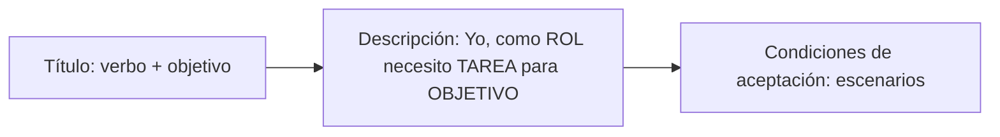

# Estructura de una historia de usuario

Toda historia de usuario tiene **3 partes**: un título con verbo, una descripción "Yo, como… necesito… para…" y condiciones de aceptación.

## Estructura
- **Título:** empieza con un **verbo** y describe el **objetivo** claramente.
- **Descripción:** *Yo, como (tipo de usuario) necesito (tarea) para (objetivo).*
- **Condiciones de aceptación:** **pruebas para validar que se cumple la historia**; entregan **información adicional al desarrollador**.

## Ejemplo 1
- **Título:** Recuperar contraseña.
- **Descripción:** Como usuario necesito recuperar mi contraseña para poder ingresar al sistema en caso de olvidar mi contraseña.
- **Condiciones de aceptación:** ver el escenario completo en [[03 - Criterios de aceptación (Dado-Cuando-Entonces)|Criterios de aceptación]].

> [!tip] Complemento — cada parte en detalle (libro del curso, cap. 4.3)
> - Clásicamente es **una tarjeta por historia**: en el anverso el título y la descripción; en el reverso, las condiciones de satisfacción.
> - **Primer espacio (rol):** un rol **específico** entre los tipos de usuario. Por ejemplo, en una app para alumnos, ayudantes y profesores: "yo, como alumno…" o "yo, como profesor…".
> - **Segundo espacio (meta):** lo que el usuario realmente necesita que haga esa funcionalidad. Por ejemplo: "…necesito revisar las notas de mis alumnos…".
> - **Tercer espacio (justificación, el "para"):** es muy importante porque
>   - **evita agregar funcionalidades innecesarias**, y
>   - **ayuda a entender mejor** la funcionalidad.

> [!example] Ejemplo extra — del libro
> - **Título:** Encontrar reseñas de restaurantes cercanos.
> - **Descripción:** Yo, como simple usuario de la aplicación, necesito revisar reseñas de los restaurantes cercanos a donde me encuentro para seleccionar un lugar adecuado para cenar.
> - **Condiciones de aceptación (Escenario 1):** Dado un usuario que ingresa a la aplicación, cuando el usuario comparte su ubicación con la aplicación, entonces el sistema debe mostrar los restaurantes más cercanos a su ubicación, ordenados por recomendación.

> [!example] Ejemplo extra — de las slides (cajero automático)
> - **Título:** Retirar dinero del cajero automático.
> - **Descripción:** Como cliente del banco quiero ser capaz de retirar dinero de mi cuenta del cajero automático para que pueda retirar dinero de diferentes lugares.
> - **Escenario 1, retiro exitoso:** **Dado** un usuario que tiene una cuenta en el banco, suficiente dinero en su cuenta, una tarjeta del banco válida y el cajero cuenta con dinero; **cuando** el usuario ingrese su PIN y la cantidad de dinero a retirar; **entonces** el sistema debe entregar el dinero al usuario, registrar el monto debitado y devolver la tarjeta al cliente.

> [!warning] Ojo con el rol genérico
> El libro recomienda evitar el genérico "como usuario" y usar un rol más específico (ver [[05 - Errores comunes en historias de usuario|Errores comunes]]). El ejemplo "Recuperar contraseña" usa "como usuario". Ahí es aceptable porque cualquier usuario puede olvidar su contraseña, pero en general conviene precisar el rol.

## Preguntas de repaso

1. ¿Cuáles son las 3 partes de una historia de usuario?
> [!question]- Respuesta
> Título (empieza con verbo y describe el objetivo), descripción ("Yo, como [rol] necesito [tarea] para [objetivo]") y condiciones de aceptación (pruebas para validar que se cumple).

2. ¿Por qué es importante la parte "para…" de la descripción?
> [!question]- Respuesta
> Porque justifica la funcionalidad: evita agregar funcionalidades innecesarias y ayuda a entender mejor qué se necesita y por qué.

3. Escribe una historia completa para "dejar reseñas" en una app de servicios.
> [!question]- Respuesta
> Ejemplo:
> - **Título:** Dejar una reseña de un servicio.
> - **Descripción:** Yo, como cliente que contrató un servicio, necesito dejar una reseña con nota y comentario para ayudar a otros clientes a elegir.
> - **Escenario 1:** Dado un cliente con un servicio finalizado, cuando ingresa una nota de 1 a 5 y un comentario y presiona "Publicar", entonces el sistema guarda la reseña y la muestra en el perfil del proveedor.

4. ¿Qué tipo de requisito describe típicamente una historia de usuario?
> [!question]- Respuesta
> Un requisito funcional que aporta valor al usuario.
