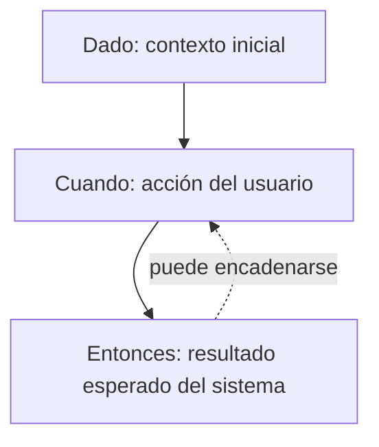

# Criterios de aceptación (Dado-Cuando-Entonces)

Las condiciones de aceptación son los **escenarios que permiten verificar** que una historia de usuario está cumplida. En el curso se escriben con el formato **Dado / Cuando / Entonces** (*Given / When / Then*).

## Ejemplo: Recuperar contraseña
**Condiciones de aceptación:**
- **Escenario 1: Recuperación exitosa (happy path)**
  - **Dado** un usuario que navega a la página de inicio,
  - **Cuando** el usuario selecciona la opción "recuperar contraseña" e ingresa un email válido,
  - **Entonces** el sistema debe enviar un enlace al email ingresado.
  - **Cuando** el usuario entra al sistema a través del enlace,
  - **Entonces** el sistema le permite al usuario establecer su nueva contraseña.

> [!tip] Complemento (slides "Historias de Usuario" y libro del curso, cap. 4.3)
> - Las condiciones de aceptación *(acceptance criteria)* pueden entenderse como **"pruebas de validación"**, pero además entregan **información valiosa adicional al desarrollador**.
> - La estructura **Given–When–Then** permite verificar, una vez terminada la historia, que funciona y cumple los resultados esperados a partir de un punto de partida específico:
>   - **Dado (Given):** el estado o contexto inicial.
>   - **Cuando (When):** la acción o evento.
>   - **Entonces (Then):** el resultado observable esperado.
> - Una historia puede tener **varios escenarios**: el *happy path* (camino feliz) y los caminos alternativos o de error.

> [!example] Ejemplo extra — escenario de error para la misma historia
> **Escenario 2: email no registrado**
> - **Dado** un usuario en la página de inicio,
> - **Cuando** selecciona "recuperar contraseña" e ingresa un email que no está registrado,
> - **Entonces** el sistema muestra un mensaje de que no se puede enviar el enlace y no envía ningún correo.

> [!tip] Complemento — de criterio de aceptación a test
> Cada escenario se puede convertir casi directamente en una prueba automatizada: el **Dado** es la preparación, el **Cuando** es la acción y el **Entonces** son los *asserts*. Es la misma estructura de inicialización, estímulo y verificación que se usa en las pruebas en Rails (tema Testing).

## Preguntas de repaso

1. ¿Qué representa cada parte del formato Dado–Cuando–Entonces?
> [!question]- Respuesta
> Dado = el contexto o estado inicial; Cuando = la acción o evento que ocurre; Entonces = el resultado esperado que se puede verificar.

2. ¿Qué es el "happy path"?
> [!question]- Respuesta
> El escenario en que todo sale bien (por ejemplo, el usuario ingresa un email válido y recibe el enlace). Los escenarios alternativos cubren errores o casos excepcionales.

3. ¿Para qué sirven las condiciones de aceptación además de validar la historia?
> [!question]- Respuesta
> Entregan información adicional al desarrollador sobre el comportamiento esperado, y se pueden traducir en pruebas automatizadas.
