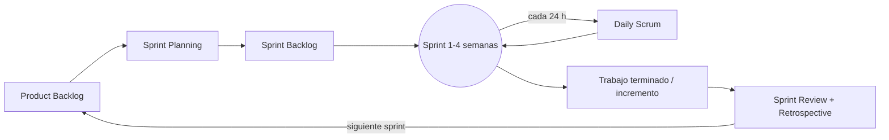

# Scrum

Scrum es el marco ágil más usado: el producto se desarrolla en **sprints** (iteraciones cortas de duración fija) y cada sprint entrega un incremento de software funcional, con 3 roles y un conjunto fijo de reuniones.

## Para qué sirve
- Es útil para **ambientes complejos o caóticos**.
- Promueve la **flexibilidad** y la **colaboración** en el desarrollo de software.

## La esencia de Scrum
La esencia de Scrum se reduce a los siguientes puntos:
- El desarrollo de software se lleva a cabo en **ciclos repetitivos llamados "sprints"**, que representan períodos de tiempo específicos.
- Cada sprint agrega un **incremento de funcionalidad** al producto y genera un resultado **"potencialmente entregable"**, es decir, un incremento de software funcional.
- El contenido del sprint se define en gran medida mediante una **negociación activa con el representante del cliente**, conocido como **"product owner"**.
- Al concluir cada sprint, se realizan **dos reuniones esenciales** antes de embarcarse en el siguiente ciclo:
  - La reunión de **"review"**, que implica evaluar y presentar lo que se ha logrado durante el sprint, así como identificar lo que aún debe abordarse.
  - La **"retrospectiva"**, una sesión reflexiva en la que el equipo analiza y discute cómo funcionó el proceso durante el sprint anterior y cómo se pueden realizar mejoras.

Versión en texto del diagrama:

## Mapa del tema
| Roles | Eventos (actividades) | Artefactos |
|---|---|---|
| [[02 - Product Owner\|Product Owner]] | [[06 - Sprint\|Sprint]] (incluye la ejecución) | [[05 - Product Backlog\|Product Backlog]] |
| [[03 - Scrum Master\|Scrum Master]] | [[07 - Sprint Planning\|Sprint Planning]] | [[08 - Sprint Backlog\|Sprint Backlog]] |
| [[04 - Equipo de desarrollo Scrum\|Equipo (Team)]] | [[09 - Daily Scrum\|Daily Scrum]] | Incremento potencialmente entregable |
| | [[10 - Sprint Review\|Sprint Review]] | |
| | [[11 - Sprint Retrospective\|Sprint Retrospective]] | |

> [!tip] Complemento — para qué tipo de proyectos es más útil (slides "SCRUM - una introducción rápida")
> 
>
> La **matriz de Stacey** cruza dos ejes: qué tan de acuerdo están todos sobre los **requisitos** y qué tan cierta es la **tecnología**. Hay cuatro zonas:
> - **Simple:** requisitos acordados y tecnología conocida. Basta un plan.
> - **Complicado:** hay algo de desacuerdo o de incertidumbre, pero se resuelve con análisis y expertos.
> - **Complejo:** mucha incertidumbre en requisitos y tecnología. **Es la zona donde más sirve Scrum**, porque permite inspeccionar y adaptar en cada sprint.
> - **Anarquía:** nada está claro; ningún proceso funciona bien.
>
> Esto calza con tu apunte: "útil para ambientes complejos o caóticos".

> [!tip] Complemento — origen y relación con los principios ágiles (libro del curso, cap. 3)
> - Lo presentaron formalmente **Ken Schwaber y Jeff Sutherland en 1995**. El libro lo atribuye a Schwaber "a fines de los 90", cuando se difundió ampliamente. La referencia oficial actual es la **Scrum Guide** (versión 2020).
> - Scrum responde a los principios ágiles porque:
>   - **abraza la variabilidad** (el cambio es inevitable);
>   - desarrolla en forma **iterativa e incremental**;
>   - **inspecciona y adapta** constantemente;
>   - fomenta la **transparencia** (todos saben lo que está pasando);
>   - **reduce las incertezas** avanzando en pasos pequeños.
> - Muchas empresas usan Scrum: las slides muestran logos de Microsoft, Apple, Oracle, IBM, Intel, SAP, entre otras.

> [!example] Ejemplo extra — un sprint de 2 semanas en un proyecto del curso
> **Lunes, semana 1:** en el Sprint Planning el equipo toma 4 historias de usuario del Product Backlog, las divide en tareas y define el objetivo del sprint ("el usuario puede registrarse y editar su perfil"). **Cada día:** daily de 15 minutos. **Viernes, semana 2:** Sprint Review (demo al ayudante o cliente) y retrospectiva ("los PR tardaron mucho en revisarse → definimos revisores fijos").

## Preguntas de repaso

1. ¿Para qué tipo de ambientes es útil Scrum?
> [!question]- Respuesta
> Para ambientes complejos o caóticos, donde los requisitos y la tecnología tienen incertidumbre y hace falta flexibilidad y colaboración.

2. ¿Qué significa que cada sprint genere un resultado "potencialmente entregable"?
> [!question]- Respuesta
> Que al final del sprint hay un incremento de software funcional (completo y probado) que se podría entregar al cliente si el Product Owner así lo decide.

3. ¿Cuáles son las dos reuniones al final de cada sprint y en qué se diferencian?
> [!question]- Respuesta
> La Sprint Review evalúa y presenta **el producto**: lo logrado y lo que falta. La Sprint Retrospective reflexiona sobre **el proceso**: cómo trabajó el equipo y qué mejorar.

4. Nombra los 3 roles, 3 artefactos y los eventos de Scrum.
> [!question]- Respuesta
> - **Roles:** Product Owner, Scrum Master, Team.
> - **Artefactos:** Product Backlog, Sprint Backlog, incremento.
> - **Eventos:** Sprint, Sprint Planning, Daily Scrum, Sprint Review, Sprint Retrospective (con la ejecución del sprint en medio).

5. Verdadero o falso: Scrum es un proceso iterativo pero no incremental.
> [!question]- Respuesta
> Falso. Es iterativo **e** incremental: cada sprint agrega funcionalidad (incremento) y ajusta el producto según el feedback.
