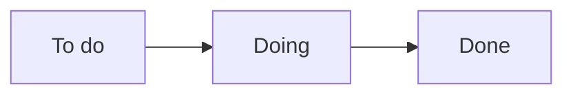

# Sprint Backlog

El Sprint Backlog es el **plan del sprint**: los ítems del Product Backlog que el equipo se comprometió a hacer en el sprint, divididos en tareas y organizados en un tablero.

## En mis apuntes
Se arma en el [[07 - Sprint Planning|Sprint Planning]] como uno de los objetivos del sprint:
- **Sprint Backlog:** To do / Doing / Done

> [!tip] Complemento — qué contiene (libro del curso, cap. 3.5)
> - Los elementos del Product Backlog **comprometidos** para el sprint.
> - **Tareas más detalladas y estimadas** que el equipo debe completar para cumplir el objetivo del sprint.

> [!tip] Complemento — manejo del Sprint Backlog (slides "SCRUM - una introducción rápida")
> - Cada persona **se suscribe** al trabajo que elige.
> - **El trabajo nunca se asigna.**
> - El tiempo estimado de cada tarea **se actualiza diariamente**.
> - **Cualquier miembro del equipo puede agregar, borrar o cambiar el sprint backlog.**

> [!warning] Las fuentes se contradicen
> El libro dice: *"una vez iniciado el sprint no se pueden agregar ni quitar nuevas tareas"*. Las slides dicen que *cualquier miembro puede agregar, borrar o cambiar el sprint backlog*.
>
> **Cómo conciliarlo** (Scrum Guide 2020): lo que **no cambia** durante el sprint es el **objetivo del sprint**, y no se hacen cambios que lo pongan en peligro. Las **tareas** del Sprint Backlog sí las ajustan los desarrolladores a medida que aprenden más. Si se descubre que un ítem no cabe, el alcance se renegocia con el Product Owner. Registrado en `_meta/DUDAS.md`.

> [!example] Ejemplo extra — Sprint Backlog con horas restantes por día (slides)
> | Tareas | Lun | Mar | Mié | Jue | Vie |
> |---|---|---|---|---|---|
> | Code the user interface | 8 | 4 | 8 | | |
> | Code the middle tier | 16 | 12 | 10 | 4 | |
> | Test the middle tier | 8 | 16 | 16 | 11 | 8 |
> | Write online help | 12 | | | | |
> | Write the foo class | 8 | 8 | 8 | 8 | 8 |
> | Add error logging | | | 8 | 4 | |
>
> Cada celda indica las **horas que faltan** para la tarea ese día. Que los números suban (por ejemplo, "Test the middle tier" pasa de 8 a 16) significa que el equipo descubrió más trabajo: por eso la estimación se actualiza a diario. Sumando por día se obtiene el *burndown* del sprint.

## Preguntas de repaso

1. ¿Qué es el Sprint Backlog y en qué reunión se crea?
> [!question]- Respuesta
> Es el conjunto de ítems del Product Backlog comprometidos para el sprint, divididos en tareas estimadas, junto con el plan para lograrlos (To do / Doing / Done). Se crea en el Sprint Planning.

2. ¿Quién asigna las tareas del Sprint Backlog?
> [!question]- Respuesta
> Nadie: los miembros del equipo se suscriben al trabajo que eligen. El trabajo nunca se asigna.

3. ¿Se puede modificar el Sprint Backlog durante el sprint?
> [!question]- Respuesta
> El objetivo del sprint no cambia. Las tareas sí se ajustan (las estimaciones se actualizan a diario y los desarrolladores pueden agregar o cambiar tareas). Los cambios de alcance se negocian con el PO sin poner en riesgo el objetivo. El libro del curso es más estricto y dice que no se agregan ni quitan tareas.
